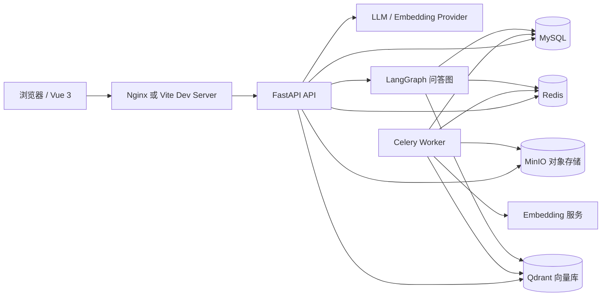
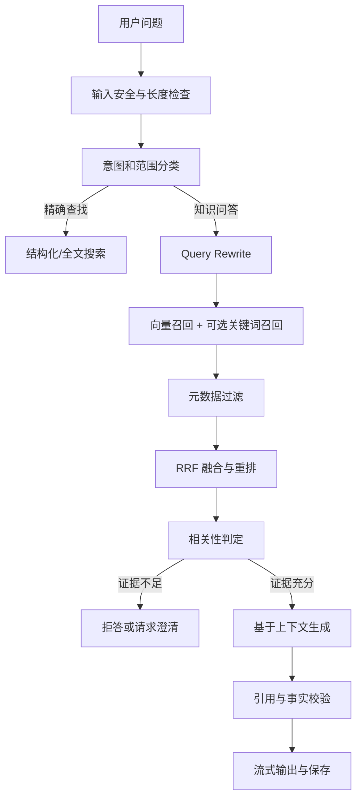

# 诗词 RAG 全栈项目开发日志

> 项目代号：Poem RAG  
> 文档状态：持续开发日志 v1.0  
> 创建日期：2026-09-19  
> 最后更新：2026-09-20  
> 技术方向：Vue 3 全栈 + Python/FastAPI + LangChain/LangGraph + RAG  
> 默认领域：中国诗词知识库与智能问答

## 1. 文档目的

这份文档既是项目设计说明，也是持续追加的开发日志。每次开发或讨论后，至少记录以下内容：

1. 本次目标。
2. 做出的决策和原因。
3. 完成的功能或文档。
4. 执行过的测试与结果。
5. 未解决问题和下一步。

技术栈不是一次性固定的。若某项技术不能降低复杂度、不能改善可验证性，或明显不适合当前学习阶段，应在“架构决策记录”中说明后替换。

---

## 2. 项目定义

### 2.1 项目目标

建设一个可运行、可测试、可迭代的诗词 RAG 应用，让用户可以：

1. 浏览、筛选和检索诗词原文及作者信息。
2. 使用自然语言寻找诗句、人物、意象、朝代或主题相关内容。
3. 针对语料提问，并获得带原文引用、来源和置信信息的回答。
4. 在没有可靠依据时明确表示“不确定”或“语料中没有足够信息”，而不是编造。
5. 由管理员导入、修订、删除和重建诗词语料。

这个项目同时承担两个目标：

1. 完成一个工程结构完整的全栈 AI 项目。
2. 系统学习 Python 全栈、异步 API、数据库、缓存、任务队列、RAG、Agent 编排、测试和部署。

### 2.2 核心用户流程

#### 流程 A：查诗

用户输入作者、标题或诗句，系统优先返回精确或高相关结果，不调用大模型也能完成。

#### 流程 B：知识问答

用户提出“李白诗中常见的月亮意象有哪些”之类的问题。系统先检索语料，再基于证据生成回答，并展示引用。

#### 流程 C：语料管理

管理员上传或录入诗词，触发解析、切块、向量化和索引。任务失败时可以查看原因并重试。

#### 流程 D：效果评估

开发者运行固定评估集，比较不同切块、Embedding、检索、重排和提示词方案的效果，决定是否保留改动。

### 2.3 MVP 边界

MVP 必须完成：

1. 用户注册、登录和权限基础。
2. 诗词列表、详情、筛选和基础搜索。
3. 单文件或结构化数据的语料导入。
4. 向量检索、引用展示和基础 RAG 问答。
5. 对话持久化、SSE 流式输出和低置信度拒答。
6. 管理端导入任务状态。
7. 自动化测试、基础评估脚本和 Docker Compose 开发环境。

MVP 暂不包含：

1. 多 Agent 自主协作和复杂的自动规划。
2. 知识图谱、推荐系统和社交功能。
3. 多租户、计费和超大规模分布式部署。
4. 全量音视频、图片或 OCR 语料处理。
5. 为了“看起来高级”而引入的微服务拆分。

### 2.4 非功能目标

1. 可复现：新环境使用文档和 Docker Compose 可以启动。
2. 可观测：请求、检索、模型调用、耗时、Token 和错误均有日志或指标。
3. 可测试：业务逻辑不依赖真实大模型，也能稳定运行测试。
4. 可替换：模型、Embedding、向量数据库通过适配层隔离。
5. 数据可信：问答必须能追溯到具体 chunk 和来源。
6. 安全：密钥不入库、不入 Git，上传内容不直接作为 HTML 执行。
7. 成本可控：记录 Token 和调用次数，设置超时、重试和限额。

---

## 3. 工程原则

1. **先打通纵切面**：先完成“导入一首诗 -> 建立索引 -> 提问 -> 返回引用”的最小闭环，再扩展功能。
2. **先契约后实现**：数据库模型和 API Schema 先明确，前后端并行开发。
3. **评估驱动 AI**：RAG 改动必须通过固定数据集对比，不能只凭一次演示判断。
4. **检索与生成解耦**：先验证检索质量，再优化生成答案。
5. **数据库是事实来源**：Redis 只做缓存、短期状态和队列，不作为用户与语料的唯一数据源。
6. **向量库保存索引，MySQL 保存关系**：向量 ID 在两边可追踪、可重建。
7. **异步用于 I/O，不滥用异步**：复杂 CPU 模型任务放入独立 Worker 或模型服务。
8. **结构化输出优先**：模型需要参与流程决策时，使用 Pydantic Schema 约束结果。
9. **引用先于漂亮回答**：没有证据时宁可少答，不能补写。
10. **小步提交**：每次提交保持单一主题，并关联测试或文档。

---

## 4. 总体架构

系统采用“模块化单体 + 独立异步 Worker”作为起点。它比微服务更容易学习、部署和调试，同时保留以后拆分检索、任务和模型服务的空间。



### 4.1 各组件职责

| 组件 | 主要职责 | 不负责 |
| --- | --- | --- |
| Vue 3 | 页面、交互、状态、SSE 流式展示 | 业务规则和权限判断 |
| FastAPI | 鉴权、参数校验、业务编排、API、SSE | 长时间阻塞的索引任务 |
| MySQL | 用户、诗词、文档、对话、任务、评估等关系数据 | 大规模向量相似度检索 |
| Redis | 缓存、限流、分布式锁、任务队列、短期会话 | 唯一业务数据和长期审计 |
| Qdrant | Embedding 存储与相似度检索 | 用户、权限和完整业务关系 |
| MinIO | 原始上传文件、版本快照和导出文件 | 在线事务数据 |
| Celery Worker | 解析、清洗、切块、Embedding、重建索引 | 直接响应浏览器请求 |
| LangGraph | 问答状态机、条件路由、重试和检查点 | 替代普通 CRUD 和 SQL |
| LLM/Embedding | 生成、改写、分类、向量化 | 事实来源和唯一业务存储 |

### 4.2 为什么第一阶段不拆微服务

登录、诗词、问答、导入之间存在大量事务和调试关系。过早拆分会产生网络调用、分布式事务、链路追踪和部署成本，却不一定提高学习效率。正确顺序是：

1. 在单体中按模块划清边界。
2. 找出真正需要独立伸缩或独立故障隔离的模块。
3. 有数据支撑后再拆分，例如 Embedding Worker 或独立重排服务。

---

## 5. 技术栈基线

### 5.1 前端

| 类别 | 建议选择 | 说明 |
| --- | --- | --- |
| 核心框架 | Vue 3 + TypeScript | Composition API 和类型约束 |
| 构建工具 | Vite | 启动快，适合中小型应用 |
| 路由 | Vue Router | 页面路由和权限守卫 |
| 状态管理 | Pinia | 用户、会话和全局配置 |
| UI 组件 | Naive UI 或 Element Plus | 二选一，避免混用多套设计系统 |
| HTTP | Axios 或原生 `fetch` | 普通请求可用 Axios，流式请求优先 `fetch` + SSE |
| 表单校验 | 组件库 + Zod/Valibot 可选 | 前后端校验规则保持语义一致 |
| 测试 | Vitest + Vue Test Utils | 组件和 Store 单测 |
| E2E | Playwright | 登录、问答、引用、管理流程 |

### 5.2 后端

| 类别 | 建议选择 | 说明 |
| --- | --- | --- |
| Python | 3.12 | 生态兼容性优先于盲目追新 |
| 包管理 | uv | 安装快，支持锁定依赖和虚拟环境 |
| Web 框架 | FastAPI | 异步 API、OpenAPI、依赖注入 |
| ASGI Server | Uvicorn/Gunicorn | 开发用 Uvicorn，部署按环境配置 |
| 数据校验 | Pydantic v2 | API Schema、配置和结构化模型输出 |
| ORM | SQLAlchemy 2.x | 显式事务和成熟迁移生态 |
| 数据迁移 | Alembic | 数据库结构版本化 |
| 测试 | pytest、pytest-asyncio、httpx、Testcontainers | 单元、API 和真实依赖集成测试 |
| 质量工具 | Ruff、mypy 或 pyright | 格式、Lint 和静态类型检查 |

### 5.3 数据与基础设施

| 类别 | 建议选择 | 说明 |
| --- | --- | --- |
| 关系数据库 | MySQL 8.4 LTS | 业务事实来源 |
| 缓存与队列 | Redis 7.x | Cache、Rate Limit、Celery Broker |
| 向量数据库 | Qdrant | Docker 部署简单，过滤和检索能力完整 |
| 对象存储 | MinIO | 本地兼容 S3，后续可替换云对象存储 |
| 后台任务 | Celery + Redis | 处理导入、向量化、重建索引 |
| 容器编排 | Docker Compose | 本地开发；生产再考虑 Kubernetes |
| 反向代理 | Nginx | 静态资源、API 转发、SSE 配置 |

为什么先选 Qdrant：

1. MySQL 原生通用向量检索能力不适合作为该项目的核心假设。
2. Chroma 上手更快，但生产边界、过滤和运维能力不如 Qdrant。
3. Qdrant 可以使用 Docker 本地运行，也能平滑迁移到独立服务。
4. 如果学习目标是极致减少组件，也可先使用 `pgvector`，但那样会改变 MySQL 这一基线。

### 5.4 AI 与 RAG

| 类别 | 建议选择 | 说明 |
| --- | --- | --- |
| 基础编排 | LangChain | 模型、文档、Retriever、Tool 的标准接口 |
| 有状态流程 | LangGraph | 问答节点、条件路由、重试、Checkpoint |
| 数据切分 | LangChain TextSplitter 或自定义切块器 | 诗词必须优先保持篇、段、句边界 |
| Embedding | Qwen-Embedding（初步） | 通过可替换 Adapter 调用，需验证模型 ID、维度和批量限制 |
| 重排 | Cross-Encoder/BGE Reranker | 先做基线，再通过评估决定是否启用 |
| 生成模型 | DeepSeek 4.1 Flash（初步） | 通过统一 Provider 接口调用，需验证精确模型 ID 和流式协议 |
| 评估 | RAGAS、DeepEval 或自建指标 | 工具可选，评估数据和门槛必须保留 |
| 可观测 | LangSmith 可选 + OpenTelemetry | 外部平台可选，日志字段必须自有 |

模型和供应商不能散落在业务代码中。建议建立以下接口：

```python
class ChatModelPort(Protocol):
    async def generate(self, messages: list[Message], **kwargs) -> ChatResult: ...
    async def stream(self, messages: list[Message], **kwargs) -> AsyncIterator[ChatChunk]: ...


class EmbeddingPort(Protocol):
    async def embed_documents(self, texts: list[str]) -> list[list[float]]: ...
    async def embed_query(self, text: str) -> list[float]: ...
```

第一版模型基线：

1. Embedding 初步使用 Qwen-Embedding。
2. 问答生成初步使用 DeepSeek 4.1 Flash。
3. 精确模型 ID、API 协议、上下文限制、向量维度、限流和数据合规要求在阶段 0 验证。
4. 业务代码只能依赖统一 Provider 接口，不能直接散落供应商 SDK。

这样测试时可以注入 Fake Provider，更换模型时不需要修改业务服务。

### 5.5 工程与交付

| 类别 | 建议选择 |
| --- | --- |
| 版本控制 | Git + 清晰的分支和提交规范 |
| CI | GitHub Actions，执行 lint、类型检查、单测和构建 |
| 配置 | `.env` + Pydantic Settings；提交 `.env.example` |
| 日志 | structlog 或标准 logging + JSON 格式 |
| 指标 | Prometheus；Grafana 和 Loki 可后续加入 |
| 链路 | request_id、conversation_id、ingestion_job_id、model_call_id |
| 部署 | 前端静态资源 + API/Worker 容器 + 托管基础设施 |

---

## 6. 建议仓库结构

采用单仓库，便于前后端、评估集和基础设施一起演进：

```text
poem_project/
├─ apps/
│  ├─ web/                    # Vue 3
│  │  ├─ src/
│  │  │  ├─ api/
│  │  │  ├─ components/
│  │  │  ├─ features/
│  │  │  ├─ router/
│  │  │  ├─ stores/
│  │  │  ├─ styles/
│  │  │  ├─ types/
│  │  │  └─ views/
│  │  └─ tests/
│  └─ api/                    # FastAPI + LangGraph
│     ├─ app/
│     │  ├─ api/v1/
│     │  ├─ core/
│     │  ├─ db/
│     │  ├─ models/
│     │  ├─ schemas/
│     │  ├─ repositories/
│     │  ├─ services/
│     │  ├─ ai/
│     │  │  ├─ graphs/
│     │  │  ├─ retrievers/
│     │  │  ├─ prompts/
│     │  │  └─ providers/
│     │  └─ workers/
│     ├─ migrations/
│     └─ tests/
├─ data/
│  ├─ raw/                    # 本地样例数据，不上传敏感语料
│  ├─ eval/                   # 固定评估问题与参考答案
│  └─ seeds/                  # 开发种子数据
├─ infra/
│  ├─ compose/
│  ├─ nginx/
│  └─ monitoring/
├─ docs/
│  ├─ DEVELOPMENT_LOG.md
│  ├─ FRONTEND_BACKEND_CONTRACT.md
│  ├─ architecture/
│  └─ adr/
├─ scripts/
├─ .env.example
├─ docker-compose.yml
└─ README.md
```

模块边界建议：

1. `api` 只负责 HTTP 协议、鉴权依赖和响应映射。
2. `services` 负责用例和事务编排。
3. `repositories` 负责数据访问，不向 API 泄露 ORM 对象。
4. `ai` 负责检索、模型、Prompt、Graph 和结构化结果。
5. `workers` 调用相同 service，不复制一套业务逻辑。
6. `schemas` 是前后端契约，不直接复用数据库模型作为 API 模型。

---

## 7. 核心模块

### 7.1 身份与权限

1. 密码使用 Argon2id 哈希。
2. 短期 Access Token + 可撤销 Refresh Token。
3. 角色至少包含 `user` 和 `admin`。
4. 管理员接口必须做后端鉴权，前端隐藏按钮不算权限控制。
5. 登录、上传、问答接口按用户和 IP 限流。

### 7.2 诗词与语料

1. 诗词原文、作者、朝代、体裁、标签和出处是结构化字段。
2. 原文文件、注释和译文可以进入版本管理。
3. 同一作品允许存在多个版本，但必须可追踪来源。
4. 删除采用软删除或先撤销发布，再异步清理向量，避免上下文不一致。
5. 每个 chunk 必须携带作者、朝代、作品、版本和许可信息。

### 7.3 导入与索引

导入流程独立于请求线程：

```text
上传/录入
  -> 原始文件校验
  -> 保存对象存储
  -> 创建 ingest_job
  -> Worker 解析
  -> 规范化与去重
  -> 领域切块
  -> Embedding
  -> 写入 Qdrant
  -> 更新 MySQL 索引状态
  -> 记录统计和错误
```

关键要求：

1. 导入任务幂等，重复执行不能产生重复向量。
2. 每个任务记录阶段、进度、错误和重试次数。
3. 索引发布采用 staging/active 版本，避免重建时影响线上检索。
4. 向量写入成功但 MySQL 更新失败时，必须能通过对账任务修复。

### 7.4 搜索与 RAG

普通关键字搜索和 RAG 问答是两个入口：

1. 精确检索优先使用 MySQL 全文索引或独立搜索引擎。
2. 语义检索使用 Qdrant。
3. 成熟阶段使用 Dense + Sparse 混合召回与 RRF 融合。
4. 重排器从候选集中选出最相关的少量上下文。
5. LLM 只根据上下文回答，并输出引用 chunk ID。

### 7.5 会话与记忆

1. MySQL 保存会话和消息的长期记录。
2. Redis 保存近期上下文、流式状态和短期限流数据。
3. 默认只携带最近若干轮对话，不无限追加历史。
4. 摘要记忆属于后续能力，不应在 MVP 中替代稳定的对话持久化。
5. 用户删除会话后，相关缓存和长期记录都应进入清理流程。

---

## 8. 数据模型草案

### 8.1 核心表

| 表 | 关键字段 | 说明 |
| --- | --- | --- |
| `users` | id, email, password_hash, role, status | 用户与权限 |
| `refresh_tokens` | id, user_id, token_hash, expires_at, revoked_at | Refresh Token 撤销 |
| `authors` | id, name, dynasty, aliases, bio | 作者 |
| `poems` | id, author_id, title, dynasty, genre, status | 作品主表 |
| `poem_versions` | id, poem_id, content, notes, source, license | 原文版本 |
| `documents` | id, type, object_key, checksum, status | 上传文档 |
| `chunks` | id, version_id, chunk_index, text, token_count, vector_id | 检索片段 |
| `ingest_jobs` | id, document_id, status, stage, progress, error | 导入任务 |
| `conversations` | id, user_id, title, status, created_at | 会话 |
| `messages` | id, conversation_id, role, content, metadata | 消息 |
| `message_citations` | id, message_id, chunk_id, score, rank | 回答引用 |
| `feedback` | id, message_id, user_id, rating, comment | 用户反馈 |
| `model_calls` | id, provider, model, input_tokens, output_tokens, latency_ms | 模型调用审计 |
| `eval_datasets` | id, name, version, description | 评估集 |
| `eval_cases` | id, dataset_id, question, answer, metadata | 评估样本 |
| `eval_runs` | id, dataset_id, config_snapshot, metrics, status | 评估运行 |

### 8.2 数据完整性

1. 使用外键约束关键关系，除非有明确的性能或分库理由。
2. 时间统一保存 UTC，前端按用户时区展示。
3. 向量库中的 payload 至少包含 `chunk_id`、`poem_id`、`version_id`、`author_id`、`dynasty` 和 `status`。
4. 所有“可重新生成”的数据都保留生成参数，例如切块大小、Embedding 模型和 Prompt 版本。
5. 文本导出、日志和错误消息都要避免泄露密钥及隐私数据。

---

## 9. API 契约草案

统一前缀：`/api/v1`

### 9.1 身份

| 方法 | 路径 | 用途 |
| --- | --- | --- |
| POST | `/auth/register` | 注册 |
| POST | `/auth/login` | 登录 |
| POST | `/auth/refresh` | 刷新令牌 |
| POST | `/auth/logout` | 注销和撤销令牌 |
| GET | `/users/me` | 当前用户 |

### 9.2 诗词

| 方法 | 路径 | 用途 |
| --- | --- | --- |
| GET | `/poems` | 分页、筛选、搜索 |
| GET | `/poems/{poem_id}` | 作品详情 |
| GET | `/authors` | 作者列表 |
| GET | `/search` | 搜索统一入口 |

### 9.3 问答

| 方法 | 路径 | 用途 |
| --- | --- | --- |
| POST | `/conversations` | 创建会话 |
| GET | `/conversations` | 会话列表 |
| GET | `/conversations/{id}/messages` | 历史消息 |
| POST | `/conversations/{id}/messages:stream` | SSE 流式提问 |
| DELETE | `/conversations/{id}` | 删除会话 |
| POST | `/messages/{id}/feedback` | 回答反馈 |

SSE 事件建议：

```text
event: meta
data: {"message_id":"...","conversation_id":"..."}

event: retrieval
data: {"candidate_count":20,"selected_count":5}

event: delta
data: {"text":"..."}

event: citation
data: {"chunk_id":"...","poem_id":"...","title":"..."}

event: done
data: {"finish_reason":"stop","latency_ms":1234}

event: error
data: {"code":"MODEL_TIMEOUT","message":"..."}

```

### 9.4 管理

| 方法 | 路径 | 用途 |
| --- | --- | --- |
| POST | `/admin/documents` | 上传语料 |
| POST | `/admin/ingest-jobs` | 创建导入任务 |
| GET | `/admin/ingest-jobs/{id}` | 查询任务进度 |
| POST | `/admin/indexes/rebuild` | 重建索引 |
| GET | `/admin/eval-runs` | 查看评估结果 |

### 9.5 系统

| 方法 | 路径 | 用途 |
| --- | --- | --- |
| GET | `/health/live` | 进程存活 |
| GET | `/health/ready` | MySQL、Redis、Qdrant 等依赖就绪 |
| GET | `/metrics` | Prometheus 指标，需限制访问 |

---

## 10. RAG 设计

### 10.1 语料加工策略

诗词不能简单按固定字符粗暴切分。推荐顺序：

1. 识别作品标题、作者、朝代、序、正文、注释、译文和出处。
2. 以整篇作品作为最小语义单元；长作品再按段或句切分。
3. 为每个 chunk 保留相邻关系，用于上下文扩展。
4. 对短诗可以“作品级 chunk”，对长文可使用 300 至 800 Token 的块并设置重叠。
5. 切块参数必须版本化，不能更换参数后混用旧向量。

chunk metadata 示例：

```json
{
  "chunk_id": "42",
  "poem_id": "1001",
  "version_id": "8",
  "title": "静夜思",
  "author": "李白",
  "dynasty": "唐",
  "genre": "五言绝句",
  "chunk_index": 0,
  "source": "样例语料",
  "license": "待确认",
  "embedding_model": "model-version",
  "chunk_strategy": "poem-v1"
}
```

### 10.2 查询流程



### 10.3 LangGraph 状态机

MVP 图保持小而清晰：

```text
validate_input
  -> classify_intent
  -> rewrite_query
  -> retrieve
  -> grade_documents
  -> generate_answer
  -> verify_citations
  -> persist_result
```

建议 State：

| 字段 | 含义 |
| --- | --- |
| `request_id` | 单次请求追踪 |
| `user_id` | 权限和数据隔离 |
| `conversation_id` | 会话上下文 |
| `question` | 原始问题 |
| `normalized_query` | 规范化问题 |
| `intent` | 精确查找、知识问答、闲聊、越界 |
| `filters` | 作者、朝代、作品等过滤条件 |
| `candidate_chunks` | 初筛候选 |
| `selected_chunks` | 最终上下文 |
| `answer` | 回答 |
| `citations` | 引用映射 |
| `confidence` | 置信度或证据等级 |
| `errors` | 可恢复错误 |

节点职责：

1. `validate_input`：长度、注入模式、越界和安全检查。
2. `classify_intent`：决定走结构化搜索还是 RAG。
3. `rewrite_query`：补全代词和上下文，生成检索词与过滤条件。
4. `retrieve`：调用混合检索，返回带分数的候选。
5. `grade_documents`：按阈值和重排结果筛掉弱相关片段。
6. `generate_answer`：要求模型只使用上下文，并输出结构化引用。
7. `verify_citations`：检查引用 ID 是否存在、是否支持结论。
8. `persist_result`：保存消息、引用、耗时和 Token。

第一版不要把每个节点都做成 Agent。确定性规则能用时优先用规则，只有在分类、改写、相关性判断等确实需要语义能力的位置调用模型。

### 10.4 检索与回答基线

1. Dense 召回 `top_k=20`。
2. 启用重排时输出最终 `top_n=5`。
3. 低分或无结果时拒绝生成事实性回答。
4. Prompt 明确要求：不能使用上下文外知识补全；引用必须逐条对应。
5. 对用户问题中的指令和语料中的指令做隔离，防止 Prompt Injection。
6. 答案保存所使用的 Prompt 版本、模型、检索参数和上下文 ID。

### 10.5 上下文组装

上下文不能只是简单拼接：

1. 同一作品相邻 chunk 可以合并或扩展。
2. 去重并控制总 Token。
3. 排序时兼顾相关性、来源可信度和作品完整性。
4. 每个片段标记稳定的引用编号。
5. 不把管理员备注、系统 Prompt 或隐私字段发送给模型。

---

## 11. 前端设计

### 11.1 页面

1. 登录/注册页。
2. 诗词首页：搜索、作者、朝代、标签和推荐入口。
3. 诗词详情页：原文、作者、注释、译文和来源。
4. 智能问答页：会话列表、流式消息、引用卡片、停止生成和重新生成。
5. 管理页：语料上传、导入进度、错误详情、索引重建。
6. 评估页：评估集、运行配置、指标对比和失败样本。

### 11.2 状态划分

| Store/模块 | 内容 |
| --- | --- |
| `auth` | 当前用户、令牌状态、权限 |
| `conversation` | 会话、消息、流式状态 |
| `catalog` | 诗词筛选条件、分页和缓存 |
| `adminJobs` | 导入任务和轮询状态 |
| `ui` | 主题、侧栏、全局通知 |

服务端数据优先放在查询层或 Store 的明确缓存中，避免把同一份数据复制到多个组件。

### 11.3 流式交互

1. 用户可以停止生成。
2. 网络中断时保留已接收文本，并允许重试。
3. 引用在回答完成时与消息稳定关联。
4. 桌面端可以分栏，移动端应保持输入框和关键内容可用。
5. Markdown 渲染必须做 XSS 清理。
6. 不使用会遮挡内容或导致布局跳动的动画。

---

## 12. 测试与评估

### 12.1 测试分层

| 层级 | 目标 | 工具 |
| --- | --- | --- |
| 单元测试 | 切块、Prompt 组装、权限、评分、状态转换 | pytest / Vitest |
| 集成测试 | MySQL、Redis、Qdrant、任务的真实交互 | Testcontainers |
| API 测试 | 状态码、Schema、鉴权、错误码、SSE | httpx / FastAPI TestClient |
| 前端组件测试 | 表单、状态、引用卡片、错误态 | Vitest |
| E2E 测试 | 导入到提问的完整用户路径 | Playwright |
| AI 离线评估 | 检索与生成质量 | RAGAS/DeepEval/自建 |
| 在线评估 | 点赞、点踩、引用点击、拒答率 | 应用日志与反馈 |

所有测试默认使用 Fake LLM 和 Fake Embedding，避免 CI 依赖外部网络。真实模型评估按计划或手动触发，不与普通单测混在一起。

### 12.2 初始评估集

第一版准备约 100 条问题，并明确标注答案与证据：

1. 30 条精确检索问题。
2. 40 条需要综合多个片段的问题。
3. 20 条语料无法回答的问题。
4. 10 条 Prompt Injection、越界或恶意输入问题。

问题分布应覆盖不同作者、朝代、体裁和问题表达方式。评估集不能只包含演示时容易成功的样本。

### 12.3 指标与门槛

以下数字是第一版目标，不是未经验证的承诺。得到基线后应写回文档并调整：

| 指标 | 初始目标 |
| --- | --- |
| Retrieval Recall@5 | >= 0.80 |
| Retrieval MRR | 持续记录并逐版本提高 |
| Citation Precision | >= 0.90 |
| Faithfulness | >= 0.85 |
| Unanswerable 正确拒答率 | >= 0.90 |
| API 可用性 | 开发环境无未处理异常 |
| 首 Token 延迟 | 目标 < 3 秒，受模型供应商影响 |
| 模型调用失败恢复 | 超时后可控失败，不返回半截脏数据 |

每次更换切块、Embedding、重排器、Prompt 或模型，都应保存：

1. 数据集版本。
2. 代码提交版本。
3. 检索和生成配置快照。
4. 指标、耗时、Token 与成本。
5. 失败样本和结论。

---

## 13. 安全与可靠性

### 13.1 安全

1. 密码使用 Argon2id。
2. Access Token 短时有效，Refresh Token 只存哈希并支持撤销。
3. 所有资源查询都带用户或角色权限条件。
4. 上传文件校验扩展名、MIME、大小和内容。
5. 上传文件放对象存储，不使用用户文件名直接作为磁盘路径。
6. 前端 Markdown、HTML 和模型输出均做 XSS 清理。
7. API 使用 Pydantic 严格校验，ORM 查询参数化。
8. 对登录、问答和导入做 Redis 限流。
9. Prompt 与语料分层，明确语料中的指令不可执行。
10. 日志脱敏，密钥使用 Secret Manager 或环境变量注入。

### 13.2 可靠性

1. 外部模型调用设置超时、有限重试和熔断。
2. 写操作使用事务，长任务记录明确状态。
3. 导入与索引操作支持幂等和断点重试。
4. SSE 断开时停止无意义的后续生成或安全保存已生成内容。
5. 健康检查区分存活和依赖就绪。
6. 为关键失败建立可查询日志和指标，不依赖人工猜数据库状态。

---

## 14. 性能与可观测性

### 14.1 关键指标

1. API P50/P95/P99 延迟。
2. 检索候选数量、最终上下文数量和检索耗时。
3. 重排耗时。
4. 首 Token 延迟和完整回答耗时。
5. 每个请求的 Token、成本、模型和 Prompt 版本。
6. 导入任务吞吐、失败率、重试次数。
7. Redis 命中率、MySQL 慢查询、Qdrant 查询耗时。

### 14.2 性能策略

1. 先测再优化，保留基线和压测脚本。
2. 缓存作者列表、热门作品和稳定检索结果，但设置合理失效策略。
3. 批量 Embedding，避免逐条网络请求。
4. 对话历史按需读取，避免一次加载全部消息。
5. 数据库索引优先覆盖列表筛选、外键查询和任务状态查询。
6. 大文件不经过 API 进程长期驻留内存。

---

## 15. 开发阶段计划

时间只用于估算学习和迭代节奏，不作为固定承诺。每个阶段都必须能独立验收。

### 阶段 0：需求与架构基线（0.5 至 1 天）

交付：

1. 明确 MVP 用户流程和非目标。
2. 确认 MySQL、Redis、Qdrant、MinIO 的部署方式。
3. 确认第一版模型与 Embedding Provider。
4. 写 ADR：模块化单体、向量库选择、模型适配层。
5. 固化 API 与数据表草案。

验收：能画出请求流程，知道每个组件为什么存在，以及何时允许替换。

### 阶段 1：工程骨架（3 至 5 天）

交付：

1. 初始化 Git、目录、uv、Vue 工程和 Python 工程。
2. Docker Compose 启动 MySQL、Redis、Qdrant、MinIO。
3. FastAPI 健康检查、Settings、日志和异常处理。
4. SQLAlchemy、Alembic 和第一版迁移。
5. Vue 登录壳、路由、请求层和环境配置。
6. lint、类型检查、测试和 CI 最小流水线。

验收：新环境按 README 可以启动，前后端能互相调用，健康检查通过。

### 阶段 2：领域基础功能（4 至 6 天）

交付：

1. 注册、登录、刷新、角色权限。
2. 作者和诗词 CRUD。
3. 分页、筛选、详情和基础精确搜索。
4. 前端首页、列表、详情和登录流程。
5. 对应单元、API 和 E2E 测试。

验收：普通用户可以查找和浏览，管理员可以维护基础数据。

### 阶段 3：语料导入流水线（5 至 8 天）

交付：

1. 上传、对象存储和文档记录。
2. Celery Worker 和导入任务状态。
3. 解析、规范化、切块、Embedding、Qdrant 索引。
4. 失败重试、幂等和索引版本。
5. 管理端任务进度页面。

验收：导入一份语料后，可以在数据库和向量库中追踪到同一批 chunk，失败任务有明确原因。

### 阶段 4：RAG 基线（5 至 8 天）

交付：

1. 统一 Retriever 接口。
2. Dense 检索、元数据过滤、重排和上下文组装。
3. 无证据拒答。
4. 引用返回。
5. 最小评估集和评估脚本。
6. 第一个可比较的检索指标基线。

验收：能从固定问题集检索到正确证据，指标可重复执行。

### 阶段 5：LangGraph 问答流（5 至 8 天）

交付：

1. 输入校验、意图分类、改写、检索、相关性判断、生成、引用校验节点。
2. State 定义、条件边和错误分支。
3. 会话持久化、Redis 短期上下文和 Checkpoint。
4. SSE 流式接口。
5. 模型调用审计和成本记录。

验收：完整问答可追踪每个节点，外部模型失败时 API 能优雅降级。

### 阶段 6：前端完整体验（4 至 6 天）

交付：

1. 对话列表、流式回答、停止生成和重试。
2. 引用卡片和原文跳转。
3. 点赞、点踩和评论。
4. 管理端导入和索引状态。
5. 响应式布局和无障碍基础。

验收：用户可以从登录走到提问、查看引用和反馈，移动端可用。

### 阶段 7：RAG 优化与评估（5 至 10 天）

交付：

1. 固定评估集扩展到约 100 条。
2. 比较不同切块、Embedding、Top-K、重排与 Prompt。
3. 实现混合检索可选路径。
4. 建立失败样本分类和回归门槛。
5. 产出评估报告。

验收：每次 AI 改动都有前后指标，不用主观印象替代证据。

### 阶段 8：工程加固与部署（5 至 8 天）

交付：

1. Nginx、生产 Dockerfile、配置和密钥管理。
2. 数据库备份与恢复演练。
3. 限流、指标、日志、告警和追踪。
4. E2E 回归、依赖漏洞检查和部署文档。
5. 最小生产环境上线。

验收：应用可以部署、回滚、观察和恢复，关键故障有处理说明。

建议总节奏：边学习边开发约 5 至 8 周。中途如果某个阶段过大，应按“一条可验收纵向路径”继续拆分。

---

## 16. 优先级清单

### P0：没有就无法形成闭环

1. 工程骨架和本地基础设施。
2. 用户鉴权。
3. 诗词与版本数据模型。
4. 导入任务、切块、Embedding 和向量索引。
5. Dense 检索与引用。
6. LangGraph 基础问答。
7. SSE 和问答前端。
8. 单元、集成和 E2E 核心路径。
9. 基础评估集。

### P1：显著提升可用性和质量

1. 重排器。
2. 混合检索。
3. 限流、模型审计和成本看板。
4. 索引版本切换与对账。
5. 反馈驱动失败样本分析。
6. 管理端评估面板。

### P2：后续扩展

1. 多轮摘要记忆。
2. 知识图谱和多跳检索。
3. 多 Agent 工作流。
4. 个性化推荐。
5. 多模态语料。
6. 多租户和复杂权限。

---

## 17. 风险登记

| 风险 | 影响 | 处理策略 |
| --- | --- | --- |
| 语料版权和来源不清 | 无法发布或商用 | 每个版本记录来源、许可和审核状态 |
| 诗词切块破坏语义 | 检索质量差 | 先按作品和句段边界，切块策略版本化 |
| 模型幻觉 | 错误回答损害可信度 | 强制引用、低置信拒答、引用校验 |
| 评估集过小 | 优化方向失真 | 分类型、覆盖边界，保留失败样本 |
| 外部模型不稳定 | 延迟和错误波动 | Provider 适配、超时、重试、降级 |
| MySQL 与向量库不一致 | 检索幽灵数据 | 状态机、幂等、对账和重建机制 |
| Redis 被当数据库 | 数据丢失 | 只存可重建的缓存和短期状态 |
| 异步代码阻塞事件循环 | 全站延迟 | CPU/同步阻塞任务放 Worker，设置超时 |
| 过早拆微服务 | 开发效率下降 | 保持模块化单体，按数据决定拆分 |
| 技术栈不断扩张 | 学不完且不落地 | 每个阶段只引入完成当前验收所需组件 |

---

## 18. 架构决策记录

后续在 `docs/adr/` 中保存独立 ADR，格式建议：

```text
# ADR-001：采用模块化单体作为首版架构

状态：已接受
日期：2026-09-19

背景：
...

决策：
...

原因：
...

代价：
...

重新评估条件：
...
```

需要尽快确认的决策：

1. ADR-001：模块化单体，而非首版微服务。
2. ADR-002：MySQL 保存业务事实，Qdrant 保存向量索引。
3. ADR-003：LangChain/LangGraph 只承担 AI 编排。
4. ADR-004：Celery + Redis 承担异步导入。
5. ADR-005：模型和 Embedding 必须经过可替换 Provider。
6. ADR-006：评估数据和配置快照随代码版本管理。

---

## 19. 首个纵向切片

第一阶段真正要打通的最小路径：

```text
管理员导入 1 首诗词
  -> MySQL 保存作品和版本
  -> Worker 生成 chunk 和 Embedding
  -> Qdrant 建立索引
  -> 用户发送 1 个问题
  -> 检索到正确 chunk
  -> RAG 返回带引用的答案
  -> 数据库保存会话与消息
```

这个切片完成前，不扩展多 Agent、知识图谱、推荐或复杂管理功能。

完成定义：

1. 有数据库迁移。
2. 有 API 契约。
3. 有前后端交互。
4. 有失败状态和错误处理。
5. 有自动化测试。
6. 有可重复执行的检索评估。
7. 有日志可以追查请求和任务。

---

## 20. 开发日志

后续每次工作按下面的模板追加，不覆盖历史记录。

```markdown
## [YYYY-MM-DD] 主题

### 本次目标

- ...

### 上下文

- ...

### 做出的决策

- ...

### 完成内容

- ...

### 验证结果

- 执行命令：...
- 测试结果：...
- 手动验收：...

### 问题与风险

- ...

### 下一步

- ...
```

### [2026-09-19] 项目规划基线

#### 本次目标

- 梳理全栈 + RAG 项目的整体工程思路。
- 固定第一版技术栈、模块边界、阶段计划和验收方式。
- 建立可持续追加的开发日志。

#### 上下文

- 当前工作目录为空，尚未初始化 Git 和项目代码。
- 默认项目主题为诗词知识库和智能问答。
- 学习者方向为 Python 全栈，项目同时承担工程学习和作品积累目标。

#### 做出的决策

- 首版采用 Vue 3 + FastAPI + MySQL + Redis + Qdrant + LangChain/LangGraph。
- 使用模块化单体和独立 Celery Worker，暂不拆微服务。
- MySQL 作为业务事实来源，Redis 作为可重建的缓存、队列和短期状态。
- Qdrant 负责向量检索，MySQL 保存 chunk、版本和状态映射。
- LangGraph 只编排 AI 流程，普通 CRUD 不进入 Graph。
- 先完成“导入一首诗到返回一次带引用回答”的纵向切片。
- 以固定评估集和指标驱动后续 RAG 优化。

#### 完成内容

- 建立项目定义、MVP 边界和非功能目标。
- 建立总体架构、技术栈和仓库结构草案。
- 建立核心数据表、API、RAG、前端、测试和安全设计草案。
- 建立阶段计划、优先级、风险登记和 ADR 清单。

#### 验证结果

- 本轮仅创建规划文档，没有可执行代码。
- 文档已包含从需求到部署的端到端路径，后续每个阶段都有验收标准。

#### 问题与风险

- 项目领域、模型供应商和 Embedding 方案仍需在阶段 0 确认。
- 初始指标是工程目标，不是实测结论。
- 语料来源和许可必须在正式导入前确认。

#### 下一步

1. 初始化 Git 和基础目录。
2. 确认第一版模型 Provider 与 Embedding 方式。
3. 编写 ADR-001 至 ADR-003。
4. 搭建 Docker Compose、FastAPI、Vue 和自动化检查骨架。
5. 建立第一条数据库迁移与健康检查。

### [2026-09-19] 前后端框架与接口契约

#### 本次目标

- 确定用户、诗词库、爬取导入和 RAG 问答的增量模块边界。
- 确定 Vue 页面路由、FastAPI API 路由、统一响应和错误码规范。
- 为分类、作者、朝代和来源数据设计可爬取、可手工 CRUD 的模型。
- 记录第一版 Embedding 和问答模型。

#### 上下文

- Embedding 初步选择 Qwen-Embedding。
- 问答模型初步选择 DeepSeek 4.1 Flash。
- 诗词分类可能包含诗、词、曲、绝句、律诗等，具体取决于目标网站。
- 诗词既要支持后续爬取，也要支持管理员 CRUD。
- 功能需要按纵向切片逐渐添加，不能等所有模块设计完后一次性实现。

#### 做出的决策

- 前端页面路由和后端 API 路由分别定义，并通过 OpenAPI 同步类型。
- 所有普通 API 使用统一 Envelope，SSE、文件下载和 `204` 响应例外。
- API 错误使用稳定英文错误码，HTTP 状态码保持正确语义。
- 前端使用路由守卫改善体验，后端继续执行最终鉴权和资源所有权校验。
- 诗词核心表只保存规范化字段，分类使用可扩展分类表和关联表。
- 爬取原始内容保存在抓取项和对象存储中，规范化后通过统一导入服务转成诗词草稿。
- 手工 CRUD、文件导入和网站爬取共用同一套校验、发布和索引流程。
- 第一个爬虫开始前先确认目标网站 robots、服务条款、版权和页面结构。
- 第一版模型通过 Provider Adapter 接入，精确模型 ID 在阶段 0 验证。

#### 完成内容

- 新增 `docs/FRONTEND_BACKEND_CONTRACT.md`。
- 建立 Vue 页面路由和 Route Meta 草案。
- 建立 FastAPI 路由、分层目录和 API 清单。
- 建立诗词、作者、朝代、分类、来源、版本和 chunk 数据草案。
- 建立统一成功响应、分页、错误、状态码和错误码规范。
- 建立用户鉴权、诗词 CRUD、爬取导入和 SSE 问答契约。
- 建立切片 0 至切片 5 的增量开发路线。

#### 验证结果

- 本轮只新增和更新设计文档，没有可执行代码。
- 已检查路由、响应、数据模型和开发路线能够形成逐阶段闭环。
- 爬取字段变化不会要求修改诗词主表核心字段。

#### 问题与风险

- DeepSeek 4.1 Flash 的精确模型 ID、供应商和 API 能力尚未验证。
- Qwen-Embedding 的精确模型、维度和输入限制尚未验证。
- 目标网站和分类规范尚未确定，不能提前实现具体爬虫。
- 初始 API 清单覆盖面较大，实际实现仍应按切片逐步落地。

#### 下一步

1. 初始化 Git 和前后端目录。
2. 编写 ADR-001：模块化单体架构。
3. 编写 ADR-002：MySQL 与 Qdrant 数据职责。
4. 编写 ADR-003：Qwen-Embedding 与 DeepSeek Provider 适配。
5. 实现统一响应、异常处理、Request ID 和健康检查。
6. 初始化 Vue Router、页面布局、API 请求层和基础页面路由。

### [2026-09-19] 诗词目录、管理 API 与前端真实接口接入

#### 本次目标

- 落地诗词领域的基础模型：朝代、作者、分类、标签和诗词。
- 提供公开目录查询、搜索接口和管理员 CRUD、发布、软删除与恢复接口。
- 让 Vue 首页、列表、详情、作者和搜索页面读取真实 FastAPI 数据。
- 使用数据库迁移和可重复执行的种子脚本准备开发数据。
- 为权限、发布状态、版本冲突和删除恢复补充自动化测试。

#### 上下文

- 项目已有 Vue 3、FastAPI、SQLAlchemy async、Alembic 和用户认证骨架。
- 诗词数据后续既要支持网站爬取，也要支持管理员手工维护。
- 诗词分类会随目标数据源变化，因此分类和标签使用独立表及关联表，不写死在诗词主表。
- 当前 Embedding 仍计划使用 Qwen-Embedding，问答模型仍计划使用 DeepSeek 4.1 Flash；本轮尚未进入 RAG 实现。
- MySQL 服务可由系统识别，但当前启动失败，真实数据库迁移和种子尚未完成验收。

#### 做出的决策

- 公开接口只能读取 `published` 诗词；草稿、下架和软删除数据只允许管理员读取。
- 管理接口统一使用 `require_admin`，前端隐藏入口不能替代后端权限检查。
- 诗词编辑使用版本号做乐观锁；版本不一致返回稳定错误码 `POEM_VERSION_CONFLICT`。
- 删除采用软删除；恢复时回到 `draft`，避免恢复动作绕过发布审核。
- 分类采用可扩展的多对多关系，标签保留独立模型，便于后续爬虫映射和筛选。
- 公开查询接口返回分页元数据，前端请求层保留后端 `meta`，不在页面内重复拼装。
- 样例数据不再作为生产页面的数据源；旧样例搜索工具暂时保留为待清理项。

#### 完成内容

- 新增后端模型：
  - `apps/api/app/models/dynasty.py`
  - `apps/api/app/models/author.py`
  - `apps/api/app/models/category.py`
  - `apps/api/app/models/tag.py`
  - `apps/api/app/models/poem.py`
- 新增请求/响应 Schema、仓储和 `CatalogService`，覆盖列表、详情、搜索、创建、编辑、发布状态和软删除。
- 新增公开接口：
  - `GET /api/v1/poems`
  - `GET /api/v1/poems/{poem_id}`
  - `GET /api/v1/authors`
  - `GET /api/v1/authors/{author_id}`
  - `GET /api/v1/dynasties`
  - `GET /api/v1/categories`
  - `GET /api/v1/search`
- 新增管理接口：
  - `GET/POST/PATCH /api/v1/admin/poems`
  - `DELETE /api/v1/admin/poems/{poem_id}`
  - `POST /api/v1/admin/poems/{poem_id}/publish`
  - `POST /api/v1/admin/poems/{poem_id}/unpublish`
  - `POST /api/v1/admin/poems/{poem_id}/restore`
  - 作者、朝代和分类的管理员 CRUD。
- 新增迁移 `apps/api/migrations/versions/20260919_0002_create_poem_catalog.py`。
- 新增可重复执行种子 `apps/api/app/db/seed.py`。
- 前端新增 `poems`、`authors`、`categories` API 模块，并扩展统一 HTTP 请求层的分页响应支持。
- 首页、诗词列表、诗词详情、作者列表、作者详情和搜索页已接入真实接口。
- 页面补充加载中、请求失败、空结果、分页和作者详情响应式状态。
- 新增 `apps/api/tests/test_catalog.py`，覆盖权限、草稿不可见、发布、搜索、版本冲突、下架、软删除和恢复。

#### 验证结果

- 后端完整测试：
  - 执行：`.\.venv\Scripts\python.exe -m pytest -q`
  - 结果：`7 passed`，有 2 条来自第三方测试客户端的弃用警告。
- 后端静态检查：
  - 执行：`.\.venv\Scripts\python.exe -m ruff check apps\api`
  - 结果：通过。
- 新增目录测试：
  - 执行：`.\.venv\Scripts\python.exe -m pytest apps\api\tests\test_catalog.py -q`
  - 结果：`2 passed`。
- 前端类型检查：
  - 执行：`pnpm --dir apps\web typecheck`
  - 结果：通过。
- 前端单元测试：
  - 执行：`pnpm --dir apps\web test`
  - 结果：`3 passed`。
- 前端生产构建：
  - 执行：`pnpm --dir apps\web build`
  - 结果：通过；主包超过 500 kB，暂无阻断。
- 本地运行态：
  - `GET http://127.0.0.1:8000/api/v1/health/live`：`200`。
  - `GET http://127.0.0.1:5173/`：`200`，Vite 页面入口正常加载。
  - 旧后端进程未加载新增路由，已重启后确认 OpenAPI 包含诗词、作者、朝代、分类、搜索和管理接口。
  - `GET /api/v1/poems` 当前返回 `500`，因为 MySQL 不可用。
  - `GET /api/v1/health/ready` 当前返回 `503`：`database=unavailable`，`redis=not_configured`。

#### 问题与风险

- MySQL267 服务虽然存在且启动类型为自动，但当前执行启动时报错：`Cannot open MySQL267 service on computer '.'`。因此本轮未宣称迁移和种子已成功执行。
- Redis 当前未配置，问答缓存、限流和后续任务队列暂不能做真实联调。
- 前端仍保留 `src/data/samplePoems.ts`、`src/features/poems/search.ts` 和对应测试；确认无生产引用后，应在单独清理提交中替换为基于 API 类型的测试。
- DeepSeek 4.1 Flash 和 Qwen-Embedding 的精确模型 ID、接口协议与额度限制仍需在 RAG 阶段验证。

#### 下一步

1. 修复或改用可用的 MySQL 实例，执行 Alembic 迁移和种子脚本，并完成真实 CRUD 接口验收。
2. 补齐管理员登录态、权限提示和诗词管理页面，先实现创建、编辑、发布和软删除闭环。
3. 设计爬虫来源、抓取任务、原始数据和规范化转换表，遵守目标网站 robots 与版权要求。
4. 接入 Redis，用于缓存、限流和后续任务队列。
5. 完成诗词切块、Qwen Embedding、向量索引和带引用问答的纵向切片。

### [2026-09-19] 真实 MySQL/Redis 验收与管理端闭环

#### 本次目标

- 使用用户补充的真实数据库配置验证 FastAPI、SQLAlchemy 与 Alembic。
- 完成基础表迁移、种子数据导入和真实接口验收。
- 验证 Redis 与后端健康检查。

#### 上下文

- `.env` 使用 `DB_HOST`、`DB_PORT`、`DB_USER`、`DB_PASSWORD`、`DB_NAME` 保存 MySQL 配置。
- `DB_CHARSET` 也已提供，但当前连接串固定使用 `utf8mb4`。
- MySQL 8 用户使用 `caching_sha2_password` 认证。
- Redis 容器已运行并监听 `6379`。

#### 做出的决定

- 配置层同时兼容 `MYSQL_*` 与 `DB_*` 两套变量名，避免重复维护数据库凭据。
- 增加 `cryptography` 作为 MySQL 8 密码认证依赖。
- 管理端创建和更新朝代、分类后，提交事务并刷新 ORM 对象再返回，避免 MySQL 下访问服务器生成时间字段时触发异步懒加载错误。
- 当前使用 Alembic 作为数据库结构唯一入口，不启用自动建表。

#### 完成内容

- `apps/api/app/core/config.py` 增加 `AliasChoices`，兼容：
  - `MYSQL_HOST` / `DB_HOST`
  - `MYSQL_PORT` / `DB_PORT`
  - `MYSQL_USER` / `DB_USER`
  - `MYSQL_PASSWORD` / `DB_PASSWORD`
  - `MYSQL_DATABASE` / `DB_NAME`
- `apps/api/requirements.txt` 增加 `cryptography>=44.0.0,<47.0.0`。
- 修复 `CatalogService.create_dynasty()`、`update_dynasty()`、`create_category()` 和 `update_category()` 的提交后刷新。
- 根目录 `.env` 增加本机开发 Redis 地址 `REDIS_URL=redis://127.0.0.1:6379/0`。
- Alembic 成功执行 `20260919_0001` 与 `20260919_0002`。
- 种子脚本成功导入 2 个朝代、6 位作者、7 个分类和 6 首已发布诗词。

#### 验证结果

- 应用层异步数据库连接：
  - 执行 `SELECT 1`
  - `connection_ok=True`
- Alembic 当前版本：`20260919_0002 (head)`。
- 种子复跑：新增数量全部为 0，幂等性通过。
- 后端测试：`7 passed`，有 2 条第三方测试客户端弃用警告。
- 后端 Ruff：通过。
- 前端类型检查：通过。
- 前端单元测试：`3 passed`。
- 健康检查：
  - `/api/v1/health/live`：`200`
  - `/api/v1/health/ready`：`200`，`database=ok`、`redis=ok`
- 公开接口：
  - `/api/v1/poems`：`200`
  - `/api/v1/authors`：`200`
  - `/api/v1/dynasties`：`200`
  - `/api/v1/categories`：`200`
- 本地服务：
  - FastAPI：`http://127.0.0.1:8000`
  - Vue/Vite：`http://127.0.0.1:5173`

#### 问题与风险

- 种子数据当前不创建管理员账号，因此还没有使用真实 MySQL 完成管理员登录、创建、编辑、发布和删除的全链路验收。
- 前端仍保留旧样例搜索测试数据，后续应替换为基于 API 类型的测试。
- Qwen-Embedding 与问答模型的精确模型 ID、接口协议和额度限制仍待 RAG 阶段验证。

#### 下一步

1. 增加仅开发环境可用的管理员种子配置，并完成管理端真实 CRUD 验收。
2. 启动前端并对登录、诗词管理、目录管理页面做浏览器级验收。
3. 设计爬虫来源、合规检查、抓取任务和原始数据规范化流程。
4. 进入诗词切块、Qwen Embedding、向量索引和带引用问答的纵向切片。

### [2026-09-19] 开发管理员种子与真实管理端 CRUD 验收

#### 本次目标

- 提供开发环境专用的管理员初始化方式，避免手工改库或提交默认账号。
- 使用真实 MySQL 验证管理员登录、诗词草稿、编辑、发布、撤回、软删除和恢复。
- 补齐种子逻辑的自动化测试和配置示例。

#### 上下文

- 管理端后端接口与 Vue 页面已经存在，但数据库中没有可直接登录的管理员账号。
- `.env` 保存本机真实数据库配置和开发密钥，不能读取、输出或提交其中内容。
- 生产环境不应因为开发种子配置而自动创建管理员。

#### 做出的决策

- 管理员种子使用三个显式环境变量：
  - `SEED_ADMIN_EMAIL`
  - `SEED_ADMIN_PASSWORD`
  - `SEED_ADMIN_DISPLAY_NAME`
- 三个变量都为空时静默跳过，不提供默认邮箱或默认密码。
- 只配置其中一部分时抛出明确配置错误，避免创建出信息不完整的账号。
- 生产环境检测到任意 `SEED_ADMIN_*` 配置时拒绝执行，避免开发凭据进入生产。
- 管理员种子复用 `UserRepository` 与 `hash_password()`，重复执行保持幂等。
- 如果目标邮箱已存在但不是管理员，拒绝自动提权，避免意外扩大权限。

#### 完成内容

- `Settings` 增加开发管理员种子字段。
- `app.db.seed` 增加 `seed_admin()`，并在主流程中与目录种子一起执行。
- `.env.example` 增加三项种子变量和生产环境使用说明。
- 增加 `apps/api/tests/test_seed.py`，覆盖：
  - 未配置时跳过。
  - 首次创建和重复执行幂等。
  - 配置不完整时拒绝执行。
  - 生产环境设置种子变量时拒绝执行。

#### 验证结果

- 后端完整测试：`11 passed`。
- 后端 Ruff：通过。
- 前端类型检查：通过。
- 前端单元测试：`3 passed`。
- 真实 MySQL 管理端烟测使用临时随机凭据，完成后已清理账号和临时诗词：
  - 管理员种子：`admin_created=True`
  - 登录接口：`200`，角色为 `admin`
  - 创建草稿：通过，`status=draft`
  - 编辑：通过，乐观锁版本从 `1` 更新到 `2`
  - 发布：通过，公开详情可访问
  - 撤回：通过，公开详情返回 `404`
  - 软删除：通过，`status=archived` 且 `deleted_at` 非空
  - 恢复：通过，回到 `draft`，版本号为 `4`
  - 验收清理：临时管理员与临时诗词删除成功

#### 问题与风险

- 当前尚未把长期使用的开发管理员凭据写入本机 `.env`，因此常规种子命令会保持 `admin_created=False`。
- 真实烟测证明接口闭环可用，但不能替代浏览器级交互验收。
- 前端管理页面已经存在，下一轮应验证登录跳转、表单编辑、发布状态和错误提示。

#### 下一步

1. 在本机 `.env` 填写三项 `SEED_ADMIN_*` 配置并重新执行种子命令。
2. 使用开发管理员登录 Vue 管理端，完成浏览器级诗词和目录 CRUD 验收。
3. 确认爬虫目标来源、robots、服务条款、版权与页面结构。
4. 设计抓取任务、原始数据、规范化转换和语料切块表。

### [2026-09-19] 文档治理与开发流程基线

#### 本次目标

- 在继续扩展功能前固定需求、设计、编码、验证和文档更新流程。
- 明确前后端接口、数据库、RAG 实验和项目说明各自的事实源。
- 为后续理解和维护项目提供一份稳定的代码导览。

#### 上下文

- 仓库已有总体规划、前后端契约和持续开发日志，但三者职责存在部分重叠。
- 当前功能正从基础 CRUD 转向语料、切块、检索和问答，变更会同时影响数据库、后端、前端和评估。
- 用户需要能够从文档理解项目整体，同时避免每次继续开发都依赖聊天记录。

#### 做出的决策

- 采用分层文档结构：入口 README、当前项目说明、开发流程、接口契约和追加式开发日志。
- `FRONTEND_BACKEND_CONTRACT.md` 作为接口目标设计的唯一事实源，FastAPI OpenAPI 作为运行时实际结构。
- 跨模块、跨数据库、API 或 RAG 策略的功能，编码前在 `docs/features/` 建立功能设计文档。
- 功能按“需求与验收 -> 影响面 -> 契约 -> 迁移 -> 后端 -> 前端 -> 真实联调 -> 文档回写”推进。
- RAG 改动必须记录语料版本、关键配置、评估指标、失败样例和保留或回退结论。
- 同一阻塞原因连续尝试 3 次仍失败时，停止盲目重试，记录证据并请求必要配合。

#### 完成内容

- 新增 `docs/README.md`，说明文档职责、唯一事实源、变更顺序和阅读入口。
- 新增 `docs/DEVELOPMENT_WORKFLOW.md`，覆盖需求到验收、接口、数据库、RAG、DoD、阻塞处理、环境和 CI 门禁。
- 新增 `docs/PROJECT_GUIDE.md`，说明当前架构、请求流转、数据模型、页面地图、实现状态和代码追踪方式。
- 新增 `docs/features/README.md`，提供跨模块功能设计模板。
- 更新根 `README.md`，加入文档阅读顺序和基础验证命令。
- 更新 `FRONTEND_BACKEND_CONTRACT.md`，明确契约地位、OpenAPI 对账规则和接口变更记录。

#### 验证结果

- 已检查新增文档中的相对链接指向仓库内现有目标。
- 已核对文档中的当前路由、迁移版本、技术栈和实现状态与代码一致。
- 本轮只修改文档，没有修改运行时代码，因此未重复执行后端和前端测试。

#### 问题与风险

- 历史契约篇幅较大，部分早期接口清单仍属于目标设计，需要后续在实际实现时逐项核对 OpenAPI。
- `PROJECT_GUIDE.md` 是当前状态快照，如果功能完成后不回写，会逐渐与代码偏离。
- 功能设计模板不要求所有小修复使用，避免文档流程本身成为额外负担。

#### 下一步

1. 先为 RAG 语料、来源和版本模型编写独立功能设计文档。
2. 在契约中补充来源、导入、切块、索引、问答和评估接口。
3. 设计数据库迁移和数据生命周期，不先接爬虫。
4. 选择开放许可来源，导入小规模真实语料。
5. 完成“poem/line/note 切块 -> 检索 -> 带引用回答 -> 固定评估”的第一个纵向切片。

### [2026-09-19] RAG 语料基础验收与版本链修复

#### 本次目标

- 在真实 MySQL 上执行 `20260919_0003`，验证已有诗词版本回填。
- 为来源、版本、注释和 chunk 增加自动化测试。
- 修复编辑、归档和恢复时版本快照与来源断链的问题。
- 修复公开搜索未匹配朝代以及 `LIKE` 通配符未转义的问题。
- 回写项目说明、功能设计和开发日志。

#### 上下文

- 代码已经包含 `poem_sources`、`poem_versions`、`poem_annotations` 和 `poem_chunks`，但此前只在 SQLite 测试环境中验证过。
- 真实 MySQL 仍停留在 `20260919_0002`。
- 版本快照在无分类或标签时会触发异步 ORM 懒加载，创建诗词可能返回 `500`。
- 前端搜索页说明会匹配朝代，但后端查询此前只覆盖标题、正文、作者、分类和标签。

#### 做出的决定

- 版本快照不再遍历 ORM 关系集合，改为显式查询关联表，避免异步会话中的隐式 I/O。
- 编辑、归档和恢复生成的版本继承该诗词最新来源记录；来源不存在时保持为空。
- 搜索把朝代纳入 `q` 匹配，并对 `%`、`_` 和反斜杠进行转义，防止用户输入被当成通配符。
- `0003` 的已有诗词回填保持 `change_type=backfill`，不伪造历史正文版本。

#### 完成内容

- 新增 `apps/api/tests/test_rag_corpus.py`，覆盖：
  - 创建、编辑、归档和恢复的版本号及 `change_type`。
  - 手工来源记录和内容哈希。
  - 注释与 chunk 的关系、向量元数据和唯一约束。
  - 同一诗词版本号唯一约束。
  - 朝代搜索和 `%`、`_` 通配符转义。
- 修复 `CatalogService` 的快照关联查询和更新、归档、恢复前的 flush。
- 修复 `CatalogService` 的 `source_id` 版本继承。
- 修复 `PoemRepository._filters()` 的朝代匹配和转义。
- 更新 `PROJECT_GUIDE.md` 和 RAG 语料功能设计状态。

#### 验证结果

- 真实 MySQL 迁移：
  - 执行目录：`apps/api`
  - 命令：`..\..\.venv\Scripts\python.exe -m alembic upgrade head`
  - 结果：`20260919_0002 -> 20260919_0003`
  - 当前 revision：`20260919_0003 (head)`
- 回填核对：
  - `poem_sources=0`，尚无导入来源。
  - `poem_versions=6`，全部为 `backfill`。
  - `poem_annotations=0`，`poem_chunks=0`。
  - 快照或内容哈希为空的版本：`0`。
- 新增语料测试：`5 passed`。
- 后端完整测试：`16 passed`，有 2 条第三方测试客户端弃用警告。
- 后端 Ruff：通过。
- 前端类型检查：通过。
- 前端单元测试：`3 passed`。

#### 问题与风险

- `0003` 的回滚尚未在隔离数据库中演练；当前真实库包含种子数据，不能直接回滚。
- 版本快照目前保存结构化 JSON，但还没有版本列表、对比和回滚 API。
- chunk 表和状态已经可用，但结构化切块算法、Embedding 和 Qdrant 索引仍未实现。
- 前端仍保留旧 `samplePoems` 搜索测试代码，属于后续清理项。

#### 下一步

1. 设计并实现 `structural-v1` 切块器，覆盖整首、联句、上下阕和长诗分段。
2. 建立开放许可的小规模真实语料，并通过来源表导入。
3. 先实现 MySQL 可解释检索基线，再接入 Qwen Embedding 和 Qdrant 对比。
4. 建立固定评估问题、金标准证据、Recall@k、MRR 和拒答指标。
5. 在检索和拒答稳定后，再实现带引用生成和最小 LangGraph 条件流程。

### [2026-09-19] `structural-v1` 结构切块器

#### 本次目标

- 在不依赖 MySQL、Embedding 和 Qdrant 的前提下实现可测试的诗词切块器。
- 覆盖短诗整篇、长文本段落、正文行和注释四种边界。
- 明确原文行号、规范化文本、内容哈希和切块策略版本。

#### 上下文

- `poem_chunks` 表和 ORM 已存在，但此前没有任何算法生成 chunk。
- 当前语料没有可靠的韵书、拼音、词牌格律或 Tokenizer 信息。
- 如果直接按固定字符数切分，短诗和联句会被破坏，引用也无法定位原文行。

#### 做出的决策

- 先实现纯函数切块器，输出 `ChunkDraft`，不把数据库事务和向量索引耦合进来。
- 短篇作品保留整篇 `poem` chunk；超长作品优先按空行段落和长度边界切分。
- 每个非空正文行生成 `line` chunk；超长行优先在强标点后切分，再退到弱标点。
- 每条注释生成 `note` chunk，保留 `annotation_id` 和原始行范围。
- 暂不自动识别韵脚、平仄或上下阕；空行只作为可观察的结构边界。
- 暂不估算 Token 数，等待真实 Embedding tokenizer 和输入上限验证。

#### 完成内容

- 新增 `apps/api/app/services/chunking.py`。
- 新增 `AnnotationChunkInput`、`ChunkDraft` 和 `chunk_poem()`。
- 默认上限为 `poem=480`、`line=200`、`note=800` 字符，可通过参数覆盖。
- 保留原文 1-based 行号，CRLF 和空行不会重新编号。
- 新增 `apps/api/app/services/chunk_catalog.py`，从版本快照和已发布注释幂等重建 chunks。
- 新增 `apps/api/scripts/rebuild_chunks.py`，支持全量或指定版本重建。
- 新增 `apps/api/tests/test_chunking.py`，覆盖：
  - 短诗整篇与联句级切块。
  - 长诗空行段落和长度边界。
  - 长行标点优先切分。
  - 注释 ID 与行范围。
  - 多条注释共享连续 note 索引。
  - CRLF、空行、空内容和非法注释范围。
- 新增 `apps/api/tests/test_chunk_catalog.py`，覆盖：
  - 同一版本重复重建保持幂等。
  - 只把 `published` 注释写入 note chunks。
  - 已有 `vector_id` 时拒绝重建并返回稳定错误码。

#### 验证结果

- 切块单元测试：`8 passed`。
- 持久化集成测试：`2 passed`。
- 真实 MySQL 重建：
  - 执行目录：`apps/api`
  - 命令：`..\..\.venv\Scripts\python.exe scripts\rebuild_chunks.py`
  - 结果：`rebuilt_versions=6`，`rebuilt_chunks=21`，`stored_chunks=21`
- 后端完整测试：`26 passed`，有 2 条第三方测试客户端弃用警告。
- 后端 Ruff：通过。

#### 问题与风险

- 发布或导入任务尚未自动调用切块服务，目前需要维护脚本触发。
- 字符上限不是模型 Token 上限，必须在 Qwen Embedding 接入后重新校准。
- 当前没有评估集，不能证明 `structural-v1` 比固定字符切分更准确。
- Qdrant 旧向量清理和重新索引策略尚未定义；已有 `vector_id` 时会主动拒绝重建。

#### 下一步

1. 设计 Qdrant 向量清理和重新索引语义。
2. 把切块接入版本发布或独立导入任务。
3. 准备开放许可的小规模真实语料并导入 `poem_sources`。
4. 建立 20 至 30 个固定评估问题和金标准证据。
5. 先实现 MySQL 可解释检索基线，再接入 Qwen Embedding 和 Qdrant。

### [2026-09-19] 索引运行元数据与并发保护

#### 本次目标

- 为一次切块、Embedding 和向量写入建立可审计的运行记录。
- 保存切块策略、Embedding 模型、维度、向量集合和非敏感配置快照。
- 阻止同一诗词版本同时创建多个待执行或执行中的索引运行。
- 防止 API Key、Token、Cookie 和密码等敏感字段通过运行配置入库。
- 在真实 MySQL 上执行 `20260919_0004` 并完成全量回归。

#### 上下文

- `poem_chunks` 已能保存版本化切块，但切块结果本身不能表达“这次索引使用什么配置、执行到哪个阶段、是否成功”。
- 后续 Worker 重试、Qdrant 对账、模型切换和失败追踪都需要数据库中的运行记录，不能只依赖日志。
- 当前还没有 Worker 租约、超时回收、取消流程和 active index 原子切换。

#### 做出的决定

- 新增 `poem_index_runs`，把可复用文本切块与一次具体索引执行分开建模。
- 状态流固定为 `pending -> running -> succeeded/failed`，阶段流为 `chunk -> embed -> upsert`。
- `create_run()` 对目标 `poem_versions` 行执行 `SELECT ... FOR UPDATE`，在同一事务中检查未结束运行并创建记录。
- 同一版本已有 `pending` 或 `running` 时返回 `409 INDEX_RUN_ALREADY_ACTIVE`，避免重复 Embedding 和重复向量写入。
- `config_snapshot` 入库前递归脱敏；键名包含 `api_key`、`authorization`、`cookie`、`password`、`secret` 或 `token` 时值统一替换为 `[REDACTED]`。
- 索引运行是审计和任务编排记录，不作为检索事实源；检索最终仍以有效 chunks、向量状态和版本可见性为准。
- 暂不定义“当前有效索引”的切换和 Qdrant 清理算法，先等待 Worker 与真实向量链路。

#### 完成内容

- 新增 `apps/api/app/models/index_run.py`，定义 `PoemIndexRun`、`IndexRunStatus` 和 `IndexRunStage`。
- 新增 `apps/api/migrations/versions/20260919_0004_create_poem_index_runs.py`。
- 新增 `apps/api/app/services/index_runs.py`，实现创建、开始、切块完成、Embedding 完成、成功和失败状态转换。
- 新增错误码：
  - `INDEX_RUN_NOT_FOUND`
  - `INDEX_RUN_INVALID_STATUS`
  - `INDEX_RUN_ALREADY_ACTIVE`
- 新增 `apps/api/tests/test_index_runs.py`，覆盖正常生命周期、非法转换、失败记录、活跃运行冲突、配置脱敏和删除级联。
- 新增 `docs/features/20260919-index-run-metadata.md`，记录状态机、并发边界、数据约束、风险和后续任务。
- 更新项目说明、前后端契约和功能设计索引。

#### 验证结果

- 索引运行测试：
  - 执行：`.\.venv\Scripts\python.exe -m pytest apps\api\tests\test_index_runs.py -q`
  - 结果：`6 passed`，有 2 条第三方测试客户端弃用警告。
- 后端完整测试：
  - 执行：`.\.venv\Scripts\python.exe -m pytest -q`
  - 结果：`33 passed`，有 2 条第三方测试客户端弃用警告。
- 后端静态检查：
  - 执行：`.\.venv\Scripts\python.exe -m ruff check apps\api`
  - 结果：通过。
- 真实 MySQL 迁移：
  - 执行目录：`apps/api`
  - 命令：`..\..\.venv\Scripts\python.exe -m alembic current`
  - 结果：`20260919_0004 (head)`
- 真实 MySQL 数据核对：
  - `poem_versions=6`
  - `poem_chunks=21`
  - `poem_index_runs=0`，尚无 Worker 发起真实索引运行

#### 问题与风险

- 当前没有 Worker 租约，进程崩溃后 `running` 运行可能永久停留，需要后续超时回收。
- 应用层锁只覆盖共享 MySQL 的正常 Service 创建路径，不替代分布式任务租约和独立活动表。
- 当前没有 HTTP 任务接口、取消流程、自动重试和 Qdrant 对账。
- 运行成功不等于线上检索已经原子切换到新索引；active index 语义尚未定义。
- `0004` 已真实升级，但降级会删除运行历史，生产执行前必须确认审计数据保留要求。

#### 下一步

1. 准备开放许可的小规模真实诗词语料并导入 `poem_sources`。
2. 建立 20 至 30 条固定评估问题、标准答案和金标准证据。
3. 实现不依赖模型的 MySQL 可解释检索基线。
4. 实测 Qwen Embedding 的真实模型 ID、维度、协议和限流，再接入 Qdrant。
5. 设计 Worker 租约、超时回收、取消和 active index 切换语义。

### [2026-09-19] MySQL 可解释检索基线

#### 本次目标

- 在接入 Qwen Embedding 和 Qdrant 前，建立不依赖模型的检索对照基线。
- 从当前有效版本的 `poem_chunks` 返回 poem、line 和 note 证据。
- 返回作品、版本、作者、朝代、行号、注释类型、切块策略、得分和命中原因。
- 保证草稿、软删除、旧版本、失效注释和 disabled chunks 不会被检索。

#### 上下文

- `poem_chunks` 已有 21 个真实库 chunks，但此前没有公开检索入口。
- 直接进入向量检索会混淆问题来源：无法判断失败来自切块、词法召回、Embedding 还是生成。
- 现有 `GET /api/v1/search` 只返回整首作品的目录结果，不能表达具体证据和出处。

#### 做出的决定

- 新增独立的 `GET /api/v1/search/evidence`，不修改原有目录搜索契约。
- 策略命名为 `lexical-baseline-v1`，使用归一化后的 `LIKE` 做词法召回。
- 当前允许 `pending` 和 `ready` chunks；Embedding 接入后再决定是否只查 `ready`。
- note chunk 必须关联 `published` 注释，正文 chunk 不需要注释。
- 返回 `score` 和 `match_types`，但明确这不是最终相关性模型，也不声称准确率提升。
- 暂不启用 MySQL ngram FULLTEXT、中文分词、Qwen、Qdrant 或 LangGraph。

#### 完成内容

- 新增 `app/repositories/chunks.py`，联查作品、当前版本、作者、朝代和注释。
- 新增 `app/schemas/retrieval.py`，定义 `RetrievalEvidence`。
- 新增 `app/services/retrieval.py`，实现召回、评分、排序和序列化。
- 在 `app/api/deps.py` 增加 `get_retrieval_service()`。
- 在 `app/api/v1/search.py` 增加证据检索路由和参数校验。
- 新增 `apps/api/tests/test_retrieval.py`，覆盖 line、poem、note、过滤、草稿、软删除、旧版本、disabled chunk、通配符和空白查询。
- 新增 `docs/features/20260919-mysql-retrieval-baseline.md`，并更新文档索引、前后端契约和项目说明。

#### 验证结果

- 新检索测试：`3 passed`。
- 后端完整测试：`36 passed`，有 2 条第三方测试客户端弃用警告。
- 后端 Ruff：通过。
- 真实 MySQL 服务级烟测：
  - 查询“明月”：`candidate_count=8`，Top-5 命中《静夜思》和《水调歌头·明月几时有》的 line/poem 证据。
  - `granularity=line` 过滤：只返回 line chunks。
- OpenAPI 对账：
  - `/api/v1/search/evidence` 存在 `GET` 操作。
  - 参数包含 `q`、`limit`、`granularity`、`author_id`、`dynasty_id`。
  - 响应声明包含 `200` 和 `422`。

#### 问题与风险

- `LIKE` 在大语料上会退化为扫描，当前只适合作为小规模基线。
- 标题、作者和朝代命中会给同一作品的多个 chunks 相同元数据分，可能产生重复，需要后续聚合或 Rerank。
- 真实库 chunks 当前仍为 `pending`；向量化后需要重新定义线上检索是否允许降级到 `pending`。
- 当前没有固定评估问题和金标准证据，因此不能比较 Recall@k、MRR 或问答准确率。
- `8000` 端口上的旧 FastAPI 进程尚未加载新路由；已通过当前应用对象核对 OpenAPI，并在服务层完成真实库烟测。

#### 下一步

1. 准备开放许可的小规模真实诗词语料，导入 `poem_sources` 并完成清洗和来源记录。
2. 建立 20 至 30 条固定评估问题、标准答案和金标准证据。
3. 实测 Qwen Embedding 的模型 ID、维度、协议和限流。
4. 接入 Qdrant，并与 `lexical-baseline-v1` 在相同评估集上比较。
5. 根据评估结果设计 Sparse、RRF、Rerank 和最小 LangGraph 问答链路。

### [2026-09-19] 检索评估基线与自然语言失败分析

#### 本次目标

- 建立可复现、与数据库自增 ID 解耦的检索评估集。
- 在真实 MySQL 上记录 `lexical-baseline-v1` 的 Top-5 指标。
- 用失败样例判断后续查询改写、Dense、混合检索和 Rerank 的必要性。
- 确保评估器复用线上 `RetrievalService`，避免评估与真实检索实现漂移。

#### 上下文

- `lexical-baseline-v1` 已完成接口和服务层烟测，但此前没有固定问题、金标准证据和统一指标。
- 如果直接进入 Qwen Embedding 和 Qdrant，只能得到“看起来更相关”的演示，无法证明改善来自哪里。
- 当前真实语料仍只有 6 首种子作品，评估结果只能作为工程基线，不能冒充最终语料规模结论。

#### 做出的决定

- 金标准使用标题、作者、朝代、粒度、文本片段和行号选择器，不写 `poem_id` 或 `chunk_id`。
- 数据集首版保存为 `data/eval/retrieval_lexical_v1.json`，暂不新增数据库表。
- 指标包含 Recall@k、MRR、Hit Rate、拒答准确率、有答案无结果率、平均延迟和 P95 延迟。
- 报告保留分类指标、失败样本 ID 和完整召回快照，不删除负结果。
- 评估器通过 `RetrievalSearchPort` 依赖检索能力；真实运行注入 `RetrievalService`，测试注入 Fake。
- 后续 Qwen Embedding、Qdrant、查询改写、RRF 和 Rerank 必须使用同一数据集与词法基线比较。

#### 完成内容

- 新增 `apps/api/app/schemas/evaluation.py`。
- 新增 `apps/api/app/evaluation/retrieval.py`。
- 新增 `apps/api/scripts/evaluate_retrieval.py`。
- 新增 `apps/api/tests/test_retrieval_evaluation.py`。
- 新增 `data/eval/retrieval_lexical_v1.json`，共 27 条样本：
  - 23 条有答案。
  - 4 条应拒答。
  - 覆盖精确引用、短语、标题、作者、朝代、多证据、自然语言和无答案。
- 新增 `docs/features/20260919-retrieval-evaluation.md`，并更新功能索引、项目说明、接口契约和 README。

#### 验证结果

- 定向测试：
  - 执行：`.\.venv\Scripts\python.exe -m pytest apps\api\tests\test_retrieval_evaluation.py -q`
  - 结果：`2 passed`。
- 后端完整测试：
  - 执行：`.\.venv\Scripts\python.exe -m pytest -q`
  - 结果：`38 passed`，有 2 条第三方测试客户端弃用警告。
- 后端静态检查：
  - 执行：`.\.venv\Scripts\python.exe -m ruff check apps\api`
  - 结果：通过。
- 真实 MySQL Top-5 评估：
  - 命令：`.\.venv\Scripts\python.exe apps\api\scripts\evaluate_retrieval.py --top-k 5`
  - 样本：27，通过 24，通过率 `0.888889`。
  - `Recall@5=0.869565`，`MRR=0.869565`，`Hit Rate@5=0.869565`。
  - 拒答准确率 `1.0`，有答案无结果率 `0.130435`。
  - 平均延迟 `3.297 ms`，P95 `3.218 ms`。
- 分类结果：
  - 精确引用、短语、标题、作者、朝代和多证据：全部通过。
  - 自然语言：`0.0`，3 条全部失败。
  - 无答案：全部正确拒答。

#### 问题与风险

- 评估集只覆盖 6 首种子作品，不能代表开放许可大语料的真实难度。
- 当前失败集中在现代自然语言到作者、标题、主题和意象的语义映射，正是后续查询改写与向量检索要解决的问题。
- `LIKE` 延迟只适用于小规模语料，不能把当前毫秒级结果外推为生产性能。
- 还没有答案生成、引用准确率和忠实度指标，RAG 评估目前只覆盖检索层。
- 当前 `8000` 端口上的旧 FastAPI 进程未加载 `/search/evidence`；本轮评估通过服务层执行，不依赖旧进程。

#### 下一步

1. 选择开放许可的真实诗词来源，记录许可、来源 URL、外部 ID 和原始载荷。
2. 扩展语料后复核现有金标准，新增数据集版本，不篡改历史版本。
3. 实现 Qwen Embedding Provider，并用 Fake 测试批处理、维度、错误和重试边界。
4. 接入 Qdrant 并保存 chunk 与 vector 的可追踪映射。
5. 用同一评估集比较 Dense、混合检索、查询改写和 Rerank 的增益、延迟与成本。

### [2026-09-19] 开放许可结构化语料导入

#### 本次目标

- 建立不依赖爬虫和 HTTP 任务接口的结构化语料导入链路。
- 用版本化 JSON 统一承接人工整理、文件导入和后续爬虫输出。
- 保证重复导入幂等、内容变化可追溯、坏记录不阻断整批导入。
- 在真实语料接入前先验证来源、许可、版本和注释的写入语义。

#### 上下文

- `poem_sources`、`poem_versions`、`poem_annotations` 和 `poem_chunks` 已具备基础结构，但此前没有批量导入入口。
- 直接编写网站爬虫会把页面解析、站点规则、去重、版本和发布逻辑耦合在一起，也难以用固定测试稳定验证。
- 当前真实语料仍只有种子作品，下一步需要开放许可来源，但来源许可和字段质量必须先被记录和审核。

#### 做出的决定

- 先实现结构化 JSON 导入，爬虫后续只负责获取和初步解析，并产出相同 JSON。
- 使用 `poem_sources.source_key + external_id` 作为幂等键，复用现有唯一约束，不新增导入批次表。
- 每条记录使用 savepoint 隔离并独立提交；单条失败写入报告，后续记录继续执行。
- 新记录默认保存为草稿；`publish=true` 可以发布，`publish=false` 不撤回已经发布的作品。
- 内容或受管元数据变化时递增版本号并创建 `change_type=import` 快照，旧版本和旧注释保留。
- `raw_payload`、来源 URL、许可说明、内容哈希、抓取时间和导入时间随来源记录保存。
- 标签按 NFKC + casefold 去重，单项限制为 `1..80` 字符，单条最多 30 个。
- 首版只提供 CLI，不提前实现上传接口、导入任务、Worker、批次审计和 HTTP 错误脱敏。

#### 完成内容

- 新增 `apps/api/app/schemas/corpus_import.py`。
- 新增 `apps/api/app/services/corpus_import.py`。
- 新增 `apps/api/scripts/import_corpus.py`，支持：
  - `--input`
  - `--report`
  - `--dry-run`
  - `--rebuild-chunks`
- 新增 `apps/api/tests/test_corpus_import.py`，覆盖创建、幂等、更新版本、发布状态、坏记录隔离、重复外部 ID、标签边界和注释范围。
- 开放并复用 `CatalogService` 的来源、分类、标签和版本记录能力。
- 新增 `data/import/example_corpus_v1.json`，明确标注为格式示例，不作为生产语料。
- 新增 `docs/features/20260919-open-licensed-corpus-import.md`，记录契约、数据语义、风险和后续任务。
- 更新项目说明、前后端契约、功能文档索引和 README。

#### 验证结果

- 导入专项测试：
  - 执行：`.\.venv\Scripts\python.exe -m pytest apps\api\tests\test_corpus_import.py -q`
  - 结果：`6 passed`，有 2 条第三方测试客户端弃用警告。
- 后端完整测试：
  - 执行：`.\.venv\Scripts\python.exe -m pytest -q`
  - 结果：`44 passed`，有 2 条第三方测试客户端弃用警告。
- 后端静态检查：
  - 执行：`.\.venv\Scripts\python.exe -m ruff check apps\api`
  - 结果：通过。
- CLI 参数检查：
  - 执行：`.\.venv\Scripts\python.exe apps\api\scripts\import_corpus.py --help`
  - 结果：四个参数均可正常解析。
- 示例数据预检：
  - 执行：`.\.venv\Scripts\python.exe apps\api\scripts\import_corpus.py --input data\import\example_corpus_v1.json --dry-run`
  - 结果：`dry_run dataset_version=example-corpus-v1 source_key=example-import-format records=1`
- 本切片没有新增迁移，也没有向真实 MySQL 执行正式导入。

#### 问题与风险

- 当前报告会保存异常字符串；未来暴露为 HTTP API 前必须做错误分类和脱敏。
- 作者姓名按全局规范化姓名匹配，无法区分同名异人；已有作者也不会因导入记录自动校正朝代关系。
- 当前没有导入批次表，不能按一次 CLI 执行统一回滚；重复执行依赖来源幂等键续跑。
- `raw_payload` 可能保存来源隐私或未清洗字段，正式导入前必须限制内容范围。
- 示例数据集只验证格式，不代表已选定开放许可真实来源，也不代表已完成大规模语料清洗。

#### 下一步

1. 选择开放许可的真实诗词来源，记录来源 URL、许可、外部 ID 和原始载荷。
2. 先小规模导入并核对作者、朝代、分类、标签、版本和注释，不直接全量爬取。
3. 扩展语料后复核现有 27 条检索金标准，新增数据集版本，不篡改历史基线。
4. 实现 Qwen Embedding Provider，并用 Fake 测试批处理、维度、错误和重试边界。
5. 接入 Qdrant 后，用同一评估集比较 Dense、混合检索、查询改写和 Rerank 的增益、延迟与成本。

### [2026-09-19] Qwen Embedding Provider

#### 本次目标

- 在接入 Qdrant 前先建立可替换的 Embedding Provider 边界。
- 支持批量、维度、超时、有限重试和供应商响应校验。
- 让单元测试使用 Mock HTTP Transport，不依赖真实网络和 API Key。
- 将模型配置和敏感信息从索引业务逻辑中隔离。

#### 上下文

- 当前 RAG 语料已经有 21 个真实库 chunks，但还没有生成向量。
- 直接把 DashScope SDK 或 HTTP 细节写入索引 Service，会让测试、模型替换和错误定位耦合。
- 真实模型 ID、默认维度、上下文限制、批量和限流尚未通过账号实测，不能把未验证参数写成业务常量。

#### 做出的决定

- 定义 `EmbeddingProvider` 协议，索引编排只依赖协议，不依赖 DashScope SDK。
- 首版使用 DashScope OpenAI-compatible `/embeddings` 协议和通用 `httpx`。
- 模型 ID、维度、批量、超时、最大重试和退避基数全部配置化。
- 只重试网络错误、`408`、`429` 和 `5xx`；鉴权、参数和资源错误直接失败。
- 返回结果按 `index` 重排，并校验数量、索引、空向量和维度一致性。
- 维度允许为空以适配模型默认值，但正式写入索引前必须确认并锁定。
- 空 `QWEN_EMBEDDING_DIMENSION` 规范化为 `None`，保证 `.env.example` 可以直接复制启动。
- 当前只完成 Provider，不提前写 `poem_chunks.vector_id` 或 Qdrant 数据。

#### 完成内容

- 新增 `apps/api/app/ai/providers/embedding.py`。
- 新增 `apps/api/app/ai/providers/qwen_embedding.py`。
- 新增 `apps/api/app/ai/providers/__init__.py`。
- 新增 `apps/api/tests/test_qwen_embedding.py`，覆盖批量拆分、乱序响应、重试、不可重试错误、数量/维度异常、空输入和配置映射。
- 在 `Settings` 中新增 Qwen Embedding 配置，并修正空维度解析。
- 在 `.env.example` 中加入模型、维度、批量、超时、重试和退避配置。
- 新增 `docs/features/20260919-qwen-embedding-provider.md`，更新项目说明、契约、功能索引和 README。

#### 验证结果

- Provider 专项测试：
  - 执行：`.\.venv\Scripts\python.exe -m pytest apps\api\tests\test_qwen_embedding.py -q`
  - 结果：`8 passed`，有 2 条第三方测试客户端弃用警告。
- 后端静态检查：
  - 执行：`.\.venv\Scripts\python.exe -m ruff check apps\api`
  - 结果：通过。
- 类型检查：
  - 执行：`.\.venv\Scripts\python.exe -m mypy apps\api\app\ai apps\api\app\core\config.py`
  - 结果：通过。
- 空维度配置：
  - 环境变量 `QWEN_EMBEDDING_DIMENSION=` 解析为 `None`。
- 本切片没有调用真实 DashScope API，没有新增迁移，没有修改 HTTP 接口。

#### 问题与风险

- `text-embedding-v4` 的默认维度、上下文上限、批量上限、限流和错误格式尚未通过真实账号验证。
- 当前重试没有抖动、并发限制或熔断，高并发下可能放大供应商限流。
- 还没有把 Provider 接到 chunks、索引运行和 Qdrant，不能把 Provider 测试通过解释为向量检索已经可用。
- 跨模型维度兼容和向量重建策略尚未实现。

#### 下一步

1. 用真实 DashScope 小规模请求核对模型 ID、维度、批量、限流和错误格式。
2. 实现 chunks -> Embedding -> Qdrant upsert 的最小索引 Service。
3. 在 `poem_chunks` 中记录 `vector_id`、模型和维度，并处理重复索引冲突。
4. 实现 Dense-only 检索，与 `lexical-baseline-v1` 使用同一 27 条评估集对比。
5. 根据评估结果再决定 Sparse、RRF、Rerank 和查询改写。

### [2026-09-19] Qdrant 向量存储与最小索引闭环

#### 本次目标

- 把已持久化的 `structural-v1` chunks 通过 Embedding Provider 生成向量并写入 Qdrant。
- 用端口隔离 Qdrant SDK，保证索引编排可以依赖 Fake 进行无网络测试。
- 保存 chunk、模型、维度和 Qdrant point ID 的可追踪映射。
- 对数量、维度、Collection 配置、重复索引和跨库失败做显式处理。

#### 上下文

- 已有 21 个真实库 pending chunks、Qwen Embedding Provider、索引运行元数据和词法检索基线。
- 直接进入 Dense 检索前，必须先验证向量生成、写入和数据库回写是否形成闭环。
- MySQL 与 Qdrant 无法在一个事务内提交，因此需要明确的失败补偿和后续对账边界。

#### 做出的决定

- 定义 `VectorStorePort`，业务 Service 不直接依赖 Qdrant SDK 类型。
- Qdrant 固定使用 `dense` named vector，为后续 Sparse 或多种向量保留边界。
- point ID 使用版本、粒度、策略、序号和内容哈希生成 UUID5。
- Qdrant payload 只保存定位和过滤元数据，不保存完整正文。
- 已有任意 `vector_id` 时拒绝直接重建，避免在未清理旧向量前产生歧义。
- upsert 失败不做数据库回写；数据库回写失败时尽力删除本次已写入的点。
- 当前先实现同步最小闭环，不提前引入 Worker、队列和 active index。

#### 完成内容

- 新增 `app/ai/providers/vector_store.py` 和 `app/ai/providers/qdrant.py`。
- 新增 `app/services/indexing.py`，实现 chunks -> Embedding -> Qdrant -> MySQL 回写。
- 扩展 `ChunkRepository`，增加可索引查询、`vector_id`、模型和维度回写。
- 扩展 `IndexRunService.mark_embeddings_ready()`，支持实际维度校验。
- 新增 `EMBEDDING_PROVIDER_ERROR` 和 `VECTOR_STORE_ERROR`。
- 增加 `qdrant-client` 依赖和 Qdrant 配置项。
- 新增 `test_indexing.py` 和 `test_qdrant_vector_store.py`，覆盖成功、异常、补偿和重复索引。
- 新增 `docs/features/20260919-qdrant-vector-store.md`，并更新项目说明、契约、功能索引和 README。

#### 验证结果

- 索引与适配器专项测试：`21 passed`。
- 后端完整测试：`65 passed`，有 3 条第三方弃用或连接警告。
- 后端静态检查：Ruff 通过。
- 类型检查：AI、索引 Service、chunk 仓储和请求上下文 mypy 通过。
- 本机 `127.0.0.1:6333` 未启动，真实 Qdrant Collection、upsert 和 delete 尚未联调。
- 本切片没有调用真实 DashScope API，没有新增迁移，没有修改 HTTP 接口。

#### 问题与风险

- MySQL commit 与 Qdrant upsert 不能原子提交；当前补偿无法覆盖进程崩溃窗口。
- 同步索引可能长时间占用请求，正式任务化前需要 Worker、租约、超时和取消。
- 旧向量清理、active index 切换和跨库对账尚未实现。
- 真实 Embedding 维度、批量和限流尚未验证，Collection 一旦建立就受维度约束。

#### 下一步

1. 启动真实 Qdrant，执行 Collection 创建、维度校验、upsert 和 delete 烟测。
2. 用真实 DashScope 小规模请求核对 Qwen Embedding 模型 ID、维度、批量和限流。
3. 实现 Dense-only 检索，使用相同 27 条评估集与 `lexical-baseline-v1` 对比。
4. 根据评估结果设计 Sparse、RRF、Rerank 和最小 LangGraph 问答链路。
5. 设计 Worker、索引对账、旧向量清理和 active index 切换语义。

### [2026-09-19] 内部 Dense 检索与 MySQL 可见性回查

#### 本次目标

- 在已有 chunks -> Qwen Embedding -> Qdrant upsert 闭环之上实现可测试的 Dense 检索。
- 让 Qdrant 负责向量召回，让 MySQL 继续负责作品权限、发布状态、当前版本和正文事实。
- 支持粒度、作者、朝代和切块策略过滤，并复用现有 `RetrievalEvidence` 输出结构。
- 让离线评估脚本可以在 `lexical` 与 `dense` 两种策略之间切换。

#### 上下文

- 真实库已有 21 个 pending chunks，Qdrant 最小索引闭环和词法评估基线已经实现。
- 直接把 Qdrant 返回结果作为最终证据会绕过作品发布状态、软删除、旧版本和注释审核。
- 在切换公开接口前，需要先证明 Dense Service 的排序、过滤、失效数据回查和错误映射。

#### 做出的决定

- 新增 `VectorSearchRequest`、`VectorSearchHit` 和 `VectorStorePort.search()`，不让业务 Service 依赖 Qdrant SDK 类型。
- `DenseRetrievalService` 先调用 Qwen Embedding 生成查询向量，再按候选放大倍数查询 Qdrant。
- Qdrant payload 只用于过滤和召回定位；最终证据统一按 `vector_id` 回查 MySQL。
- MySQL 回查必须满足 `ready` chunk、已发布且未软删除作品、当前版本和已发布注释等条件。
- Dense 策略命名为 `dense-baseline-v1`，输出 `match_types=["dense_similarity"]`。
- 当前不新增 HTTP 参数，不把公开 `/api/v1/search/evidence` 从词法策略切换到 Dense。
- 先用同一 27 条评估集比较，再决定是否引入混合检索、RRF 或 Rerank。

#### 完成内容

- 扩展 `app/ai/providers/vector_store.py`，增加检索请求、命中和端口方法。
- 扩展 `app/ai/providers/qdrant.py`，实现 `query_points()`、named vector 查询、过滤器和异常包装。
- 扩展 `ChunkRepository`，增加按 `vector_id` 回查公开可见 chunk 的查询。
- 新增 `app/services/dense_retrieval.py`，实现查询向量 -> Qdrant -> MySQL -> `RetrievalEvidence`。
- 扩展 `apps/api/scripts/evaluate_retrieval.py`，增加 `--strategy lexical|dense`。
- 新增 `test_dense_retrieval.py` 和 Qdrant 查询测试，覆盖排序、过滤、草稿注释、旧版本、空查询和 Provider 错误。
- 新增 `docs/features/20260919-dense-retrieval.md`，并更新功能索引、项目说明、接口契约和 README。

#### 验证结果

- 后端完整测试：`72 passed`，有 3 条第三方弃用或连接警告。
- Dense 与 Qdrant 专项测试：`15 passed`。
- 后端静态检查：Ruff 通过。
- 类型检查：AI、Dense Service、chunk 仓储和评估脚本 mypy 通过。
- 真实 Qdrant 未启动，真实 DashScope/Qwen 未调用，因此尚未产生真实 Dense 评估指标。
- 本切片没有新增迁移，没有修改公开 HTTP 接口。

#### 问题与风险

- Qdrant 召回结果可能包含已删除、已撤回、旧版本或已失效注释的向量，当前依赖 MySQL 回查丢弃，尚需对账和清理。
- 候选放大倍数固定为 5、最大 200；需要真实语料评估延迟、召回和过滤后的截断效果。
- 余弦分数会限制到 `[0, 1]`；如果后续切换 `Dot` 距离，分数语义需要重新定义。
- 当前查询没有改写、Sparse 召回、RRF 或 Rerank，Dense 效果不能提前宣称优于词法基线。

#### 下一步

1. 启动真实 Qdrant，完成 Collection、upsert、query 和 delete 联调。
2. 用真实 Qwen Embedding 对当前 chunks 建索引，执行 `--strategy dense --top-k 5`。
3. 记录 Dense 与 `lexical-baseline-v1` 的 Recall@5、MRR、拒答、延迟和失败样例。
4. 根据评估结果决定查询改写、Sparse、RRF、Rerank 和公开 HTTP 切换。
5. 设计旧向量清理、active index 切换和 MySQL/Qdrant 对账。

### [2026-09-19] 内部 Hybrid RRF 检索

#### 本次目标

- 在词法基线和 Dense 检索之上实现可测试的混合召回基线。
- 避免直接相加规则分数和向量相似度，使用排名融合保留两路优势。
- 同一 chunk 被两路命中时只返回一次，并保留来源匹配类型。
- 让离线评估脚本支持 `--strategy hybrid`，继续使用同一 27 条评估集。

#### 上下文

- `lexical-baseline-v1` 在精确引用、短语和结构化查询上表现稳定，但三条自然语言样本全部失败。
- `dense-baseline-v1` 已完成内部 Service 和 Fake 测试，但真实 Qdrant、Qwen 和同集指标尚未完成。
- 两个检索分支共享同一个 `AsyncSession`，第一版不能并发调用。
- 在真实联调前，不能宣称 Hybrid 优于任何单路基线。

#### 做出的决定

- 新增 `HybridRetrievalService` 和策略名 `hybrid-rrf-v1`。
- 使用 Reciprocal Rank Fusion，初始 `rank_constant=60`，不直接比较异构原始分数。
- 两路各取 `limit * 5`、最多 200 个候选；按 `chunk_id` 去重。
- 排序使用 RRF 分数降序、最佳源排名升序、`chunk_id` 升序，保证同分结果稳定。
- 输出分数按两路都排第一的理论上限归一化到 `[0, 1]`，不改 `RetrievalEvidence` Schema。
- 任一分支失败即整体失败，避免把 Qdrant、Embedding 或数据库故障误判为融合效果。
- 公开 `/api/v1/search/evidence` 继续使用 `lexical-baseline-v1`。

#### 完成内容

- 新增 `apps/api/app/services/hybrid_retrieval.py`。
- 新增 `apps/api/tests/test_hybrid_retrieval.py`。
- 扩展 `apps/api/scripts/evaluate_retrieval.py`，增加 `--strategy hybrid`。
- 新增 `docs/features/20260919-hybrid-rrf-retrieval.md`。
- 更新功能索引、项目说明、接口契约和 README。

#### 验证结果

- Hybrid 专项测试：`5 passed`。
- 后端完整测试：`77 passed`，有 3 条第三方弃用或连接警告。
- 后端静态检查：Ruff 通过。
- 类型检查：AI、词法检索、Dense、Hybrid、chunk 仓储和评估脚本 mypy 通过。
- 真实 Qdrant 未启动，真实 DashScope/Qwen 未调用，因此尚未产生 Hybrid 真实指标。
- 本切片没有新增迁移，没有修改公开 HTTP 接口。

#### 问题与风险

- 两路顺序执行会增加延迟，真实 Embedding 和 Qdrant 网络调用成本尚未测量。
- 固定 `rank_constant=60` 和等权融合尚未根据真实语料调参。
- 分支失败会直接失败，正式切换前需要超时、降级、熔断和监控。
- RRF 归一化上限基于当前两路等权假设；增加分支或权重后必须重新定义。
- 当前没有 Sparse/BM25、Rerank 和查询改写，不能把 Hybrid 当作最终问答检索策略。

#### 下一步

1. 启动真实 Qdrant，完成 Collection、upsert、query 和 delete 联调。
2. 用真实 Qwen Embedding 对当前 chunks 建索引，执行 `--strategy dense --top-k 5`。
3. 在同一环境执行 `--strategy hybrid --top-k 5`，与词法和 Dense 比较。
4. 记录 Recall@5、MRR、拒答、延迟、成本和失败样例。
5. 根据真实结果决定 Sparse、Rerank、查询改写和公开 HTTP 切换。

### [2026-09-19] 查询改写与多查询 RRF 检索

#### 本次目标

- 修复词法基线上三条现代自然语言查询全部失败的问题。
- 先建立不依赖 LLM、Qdrant 和 Qwen 的确定性查询理解基线。
- 保留原查询的精确匹配能力，用多路召回和 RRF 融合提升自然语言召回。
- 在相同 27 条评估集和 6 首种子语料上记录真实 MySQL 对比，不修改公开 HTTP。

#### 上下文

- `lexical-baseline-v1` 在精确引用、短语、标题、作者、朝代和多证据类别上稳定，但
  `李白写月亮的诗句`、`苏轼关于中秋的词` 和 `表达思乡情绪的诗句` 全部失败。
- `dense-baseline-v1` 和 `hybrid-rrf-v1` 已完成内部 Service，但真实 Qdrant 和
  DashScope/Qwen 尚未联调，无法立即判断语义召回的真实增益。
- 直接使用 LLM 改写会引入模型、提示词、超时和输出校验变量，不利于先定位查询理解
  本身是否有效。

#### 做出的决定

- 新增 `QueryRewrite`、`QueryRewriter` 和 `LexiconQueryRewriter`，把改写策略与检索
  执行解耦。
- 首版只覆盖月亮、思乡、中秋和已知作者实体；只有检测到诗词意图词时才应用概念扩展，
  避免普通单字“月”被过度解释。
- 原查询始终参与召回，改写变体只作为补充，防止破坏精确引用和短语匹配。
- 新增 `expanded-lexical-v1`，每个变体分别召回，按 `chunk_id` 去重后使用
  `1 / (60 + rank)` 做 RRF 融合。
- 排序固定为 RRF 分数降序、最佳源排名升序和 `chunk_id` 升序，分数归一化到
  `[0, 1]`，匹配类型追加 `query_expansion` 和 `rrf_fusion`。
- 任一子查询失败即整体失败，不返回部分融合结果。
- 公开 `GET /api/v1/search/evidence` 继续使用 `lexical-baseline-v1`；新策略只供内部
  Service、测试和离线评估使用。

#### 完成内容

- 新增 `apps/api/app/services/query_expansion.py`。
- 新增 `apps/api/app/schemas/query_expansion.py` 和
  `data/query_expansion/lexicon_v1.json`，把词典从代码常量改为可版本化、加载时校验的
  数据配置。
- 新增 `apps/api/tests/test_query_expansion.py`，覆盖词典改写、实体识别、变体去重、
  RRF 融合、过滤透传、空查询、默认词典加载、重复项拒绝和自定义词典注入。
- 扩展 `apps/api/scripts/evaluate_retrieval.py`，增加 `--strategy expanded`。
- 新增 `docs/features/20260919-query-expansion-retrieval.md`。
- 更新功能索引、项目说明、前后端契约、检索评估文档和 README。

#### 验证结果

- 查询改写专项测试：`8 passed`。
- 后端完整测试：`85 passed`，有 3 条第三方弃用或连接警告；Ruff 和 mypy 通过。
- 相关回归测试：Hybrid 与 Dense 共 `10 passed`。
- 真实 MySQL `lexical-baseline-v1`：`24/27`，Recall@5 `0.869565`，
  MRR `0.869565`，平均延迟 `2.542 ms`。
- 真实 MySQL `expanded-lexical-v1`：`27/27`，Recall@5 `1.000000`，
  MRR `0.978261`，平均延迟 `3.769 ms`。
- 三条自然语言样本全部通过，精确引用、短语、标题、作者、朝代、多证据和拒答类别
  均未回退。
- 本切片没有新增迁移，没有调用真实 DashScope/Qwen，也没有修改公开 HTTP 接口。

#### 问题与风险

- 结果只覆盖当前 6 首种子作品，不能外推为开放语料或生产准确率。
- 词典已外置为 JSON，但仍只覆盖两条概念规则和 6 位作者，无法代表真实意象、典故和
  别名分布；当前也没有在线审核、数据库版本和热更新机制。
- 多路查询顺序复用同一个 `AsyncSession`，增加数据库调用次数和平均延迟；高并发下
  需要缓存、批量查询或独立读连接优化。
- RRF 等权融合和 `rank_constant=60` 尚未在扩展语料上调参，宽泛扩展词可能放大误召回。
- Dense、Hybrid 和 Rerank 尚未在同一真实模型环境中完成联调，不能比较最终策略优劣。

#### 下一步

1. 为词典增加来源、审批状态和数据库管理能力，并建立变更后的自动回归。
2. 扩展开放许可真实语料，复核现有金标准并新增数据集版本。
3. 启动真实 Qdrant 和 DashScope/Qwen，执行 Dense、Hybrid 与查询改写的同集对比。
4. 评估 LLM 查询改写相对规则改写的增益、延迟和成本。
5. 根据真实指标决定 Sparse、Rerank 和公开 HTTP 策略切换。

### [2026-09-19] 真实 Qdrant 联调与向量链路阻塞核对

#### 本次目标

- 启动项目专用 Qdrant，验证现有适配器不只通过 Fake 测试。
- 用确定性向量覆盖 Collection 创建、维度校验、upsert、过滤检索和删除。
- 在不污染正式 `poem_chunks_v1` 的前提下执行真实烟测并清理测试数据。
- 核对真实 Qwen Embedding 是否具备继续完成 Dense/Hybrid 评估的条件。

#### 上下文

- Qdrant 适配器、最小索引闭环、Dense Service 和 Hybrid RRF 已实现并通过 Fake 测试。
- 真实 MySQL 有 6 首种子作品、6 个版本和 21 个 `pending` chunks；没有
  `vector_id`，也没有索引运行记录。
- DashScope Key 已配置，模型为 `text-embedding-v4`，但 `QWEN_EMBEDDING_DIMENSION`
  尚未设置，真实模型维度尚未确认。

#### 做出的决定

- 使用项目专用容器 `poem-qdrant` 和命名卷 `poem_qdrant_data`，端口映射为 `6333/6334`。
- 新增 `smoke_qdrant.py`，只接受 Collection 前缀，实际名称始终附加随机后缀，
  并在 `finally` 中删除测试 Collection。
- 新增 `smoke_qwen_embedding.py`，只输出模型、配置维度、实际维度和向量范数，
  不输出向量内容或密钥。
- 在真实 Qwen 调用成功前，不索引 21 个 chunks，不切换公开 HTTP，也不声称
  Dense 或 Hybrid 有指标增益。

#### 完成内容

- 拉取并启动 Qdrant `1.19.1`，REST API `http://127.0.0.1:6333` 正常响应。
- 新增 `apps/api/scripts/smoke_qdrant.py`。
- 新增 `apps/api/scripts/smoke_qwen_embedding.py`。
- 更新 README、项目说明、前后端契约、Qdrant/Dense/Hybrid 功能文档。

#### 验证结果

- Qdrant 真实烟测通过：临时 Collection 创建、维度不匹配拒绝、upsert、
  过滤检索和删除均成功，测试 Collection 已清理。
- 后端完整测试：`85 passed`，有 3 条第三方弃用或连接警告。
- Ruff：通过。
- 相关模块 mypy：AI Provider、索引、Dense、Qdrant 烟测和 Qwen 烟测通过。
- 真实 MySQL 只读核对：`poems=6`、`versions=6`、`chunks=21`、
  `chunks_with_vector=0`、`index_runs=0`。
- 真实 MySQL `lexical-baseline-v1` 复核：`24/27`，Recall@5 `0.869565`，
  MRR `0.869565`，平均延迟 `3.098 ms`；报告已保存到
  `data/eval/reports/retrieval_lexical_baseline_v1_20260919.json`。
- 真实 MySQL `expanded-lexical-v1` 复核：`27/27`，Recall@5 `1.000000`，
  MRR `0.978261`，平均延迟 `3.445 ms`；报告已保存到
  `data/eval/reports/retrieval_expanded_lexical_v1_20260919.json`。
- 真实 Qwen 烟测未完成：沙箱内请求返回网络失败；连续三次外网审批均遇到自动审核
  服务临时故障，没有执行，因此不能据此判断 Key、模型或账号是否有效。

#### 问题与风险

- Qdrant 容器和命名卷是本地开发依赖，尚未形成项目内 Docker Compose。
- 真实模型维度未确认前不能建立正式 Collection 的固定维度契约。
- 21 个 chunks 仍未索引，Dense 和 Hybrid 只有 Fake 测试与词法/查询改写基线，
  没有真实向量指标。
- 全量 mypy 当前仍有项目既有错误，不在本次切片中扩大修改范围。

#### 下一步

1. 由用户手动执行或待网络审批恢复后执行
   `smoke_qwen_embedding.py --text 明月`，记录模型和维度。
2. 将确认后的维度写入本地 `.env`，再执行 21 个 chunks 的真实索引。
3. 依次执行 lexical、expanded、dense、hybrid 的同集评估并保存报告。
4. 根据真实指标决定是否切换公开 HTTP，以及是否需要 Rerank 或更细的意象处理。

### [2026-09-20] 在线问答与 SSE 闭环

#### 本次目标

- 把已经实现的检索和模型适配器串成一个面向登录用户的最小 RAG 问答闭环。
- 使用 LangGraph 明确查询改写、检索、生成和校验的节点边界。
- 通过 POST SSE 输出检索状态、增量回答、引用、完成和错误事件。
- 将会话、消息和引用快照持久化到 MySQL，并确保无证据时不调用生成模型。
- 在 Vue 3 中实现会话切换、流式回答、停止生成、引用展示和历史恢复。

#### 上下文

- 真实 MySQL 已有用户、诗词目录、版本、注释和 `structural-v1` chunks。
- `expanded-lexical-v1` 已在 6 首种子语料和 27 条样本上达到 `27/27`，
  因此作为本切片在线检索策略；Dense、Hybrid 和 Rerank 仍只供内部评估。
- 已有 Chat Provider 接口和 DeepSeek OpenAI-compatible 适配器，但还没有会话、
  消息、SSE 路由或前端问答页。

#### 做出的决定

- 新增 `conversations`、`messages` 和 `message_citations` 三张表，MySQL 作为长期事实
  来源；SSE 只表达一次请求的过程状态。
- 新增最小四节点 LangGraph：`rewrite -> retrieve -> generate -> validate`。
- 在线检索固定使用 `expanded-lexical-v1`，不把未完成真实同集比较的 Dense 或
  Hybrid 提前暴露给用户。
- 生成上下文最多注入 5 条证据；有证据时最终回答必须有引用，否则校验失败。
- 检索为空时返回固定拒答，不调用 Chat Provider，也不创建引用记录。
- Chat Provider 未配置时在 SSE 建立前返回 `503 CHAT_MODEL_NOT_CONFIGURED`，并且
  不写入用户消息和助手占位消息。
- 流式请求使用原生 `fetch` + 自定义 SSE 解析，不使用不支持鉴权 Header 和 POST
  JSON 的 `EventSource`。
- 引用保存完整展示快照，并将 `chunk_id` 设为可空外键，避免 chunk 重建后历史回答
  失去可读依据。

#### 完成内容

- 新增迁移 `20260920_0005_create_conversations_and_messages.py`。
- 新增会话、消息和引用模型、Repository、Schema 和 Chat Service。
- 新增 `app/ai/providers/chat.py`、`app/ai/providers/deepseek.py` 和
  `app/ai/graphs/rag.py`。
- 新增 `/api/v1/conversations` 会话 CRUD、消息历史和
  `/messages:stream` POST SSE 接口。
- 新增 Vue 问答页、`src/api/chat.ts` 流客户端和 `src/features/chat/sse.ts` 分块解析器。
- 新增后端会话/SSE 测试和前端 SSE 解析、流终态、中断及 Token 刷新重试测试。
- 新增 `docs/features/20260920-chat-rag-sse.md`，并同步项目说明、接口契约和 README。

#### 验证结果

- 后端完整测试：`91 passed`，有 3 条第三方警告。
- 后端静态检查：`ruff check apps\api` 通过。
- 前端类型检查：`pnpm --dir apps\web typecheck` 通过。
- 前端测试：`pnpm --dir apps\web test` 共 `9 passed`。
- 前端生产构建：`pnpm --dir apps\web build` 通过，仅保留既有的大 chunk 警告。
- 真实 MySQL 已执行迁移到 `0005 (head)`。
- 真实 HTTP/SSE 无证据链路联调通过：事件顺序为
  `meta -> retrieval -> delta -> done`，用户消息和助手消息均在 MySQL 中保存为
  `completed`。
- 真实 DeepSeek 生成请求和真实 Qwen Embedding 调用尚未完成账号级联调，因此本切片
  只能确认接口、编排、持久化和失败边界，不能确认真实生成质量。

#### 问题与风险

- 代码默认模型 ID 是 `deepseek-chat`；“DeepSeek 4.1 Flash”仍是待确认方向，不能
  宣称已经接通。
- 在线检索依赖规则词典和 MySQL 词法检索，开放语料下的召回质量尚未评估。
- SSE 建立后的错误仍可能以 HTTP `200` 返回，客户端必须以 `done` 或 `error` 事件
  判断终态；缺少终态事件时应按连接中断处理。
- 客户端断开与进程崩溃之间仍存在消息状态不能及时更新的窗口。
- 尚未实现会话级限流、Token 成本审计、Redis 短期记忆和消息反馈。

#### 下一步

1. 使用真实 DeepSeek 账号确认模型 ID、流式行为、限流和错误格式，并完成一次有证据
   的真实生成联调。
2. 确认 Qwen Embedding 维度、批量和真实调用，建立正式 Qdrant Collection 并完成
   21 个 chunks 的真实索引。
3. 在同一评估集比较 lexical、expanded、dense 和 hybrid，保留每条策略的报告。
4. 根据真实指标决定在线检索切换、Rerank、引用忠实度和生成质量评估方案。
5. 增加会话限流、成本审计、消息反馈和更完整的前端 E2E；之后再进入爬虫、语料扩充
   与云服务器部署。

### [2026-09-20] 真实索引 CLI 与 Qdrant 复核

#### 本次目标

- 在真实 Qwen 调用恢复前，把已经测试过的 `IndexingService` 封装成可执行入口。
- 支持按版本或批量处理当前所有 `pending` chunks，并保留每个版本的索引运行记录。
- 确认本地 Qdrant 服务仍能完成临时 Collection 的创建、写入、过滤检索和删除。

#### 上下文

- 真实 MySQL 已有 6 个版本和 21 个 `pending` chunks，尚无 `vector_id` 和索引运行记录。
- Qwen Provider、Qdrant 适配器、索引 Service 和失败补偿都已实现，但此前只能通过
  测试代码调用，缺少可审计的运维入口。
- 沙箱内调用真实 Qwen 仍失败；外网升级审批遇到自动审核服务临时故障，不能据此判断
  Key、模型或账号是否有效。

#### 做出的决定

- 新增 `apps/api/scripts/index_chunks.py`，只负责连接现有 Provider、Store 和 Service，
  不复制索引业务逻辑。
- CLI 默认复用已有 chunks，不隐式重建切块；只有显式传入 `--rebuild-chunks` 才重建。
- 支持 `--version-id` 重复指定，以及 `--all-pending` 按数据库状态发现目标版本。
- 输出只包含版本、运行 ID、chunk 数、实际维度和 Collection，不输出向量、响应正文
  或任何密钥。

#### 完成内容

- 新增 `apps/api/scripts/index_chunks.py`。
- 更新 README、项目说明和 Qdrant 功能文档中的索引操作入口。
- 本次没有修改 HTTP 接口、数据库迁移或在线检索策略。

#### 验证结果

- Qdrant 真实烟测：`smoke_qdrant.py` 通过，临时 Collection 完成创建、8 维向量
  upsert、过滤检索和删除。
- CLI 自检：`index_chunks.py --help` 正常输出参数说明。
- Ruff：`apps/api/scripts/index_chunks.py` 通过。
- mypy：从 `apps/api` 目录检查脚本通过。
- 真实 Qwen 调用仍未执行，原因是沙箱网络和外网自动审批服务均不可用。

#### 问题与风险

- CLI 仍同步执行 Embedding 和 upsert；大语料会导致命令长时间运行，正式导入需要
  Worker、租约和超时回收。
- `--all-pending` 只按 chunk 状态发现版本；如果版本中的 chunk 因注释可见性等原因
  不可索引，Service 会按现有规则拒绝并记录失败。
- 旧向量清理、模型切换和 Qdrant/MySQL 对账仍未实现。

#### 下一步

1. 外网审批恢复后执行 Qwen Embedding 烟测并记录模型、配置维度和实际维度。
2. 使用 `index_chunks.py --all-pending` 完成 21 个 chunks 的真实索引。
3. 对同一 27 条评估集执行 dense 和 hybrid 对比并保存报告。
4. 根据真实指标决定是否切换在线检索策略，再进入 DeepSeek 真实生成联调。

### [2026-09-20] DeepSeek 流式烟测入口

#### 本次目标

- 在真实账号联调前提供可重复执行的 DeepSeek Chat 流式验证入口。
- 确认模型 ID、流式增量、字符数和耗时，同时避免把完整回答写入终端或文档。

#### 上下文

- DeepSeek Provider 和在线 SSE 编排已经实现并通过 Fake Provider 测试。
- 当前没有专用 Chat 烟测脚本，真实生成只能通过完整会话链路触发，定位成本较高。
- 沙箱外网调用仍受自动审批服务故障阻塞，本切片不能声称账号级联调已经完成。

#### 做出的决定

- 新增 `apps/api/scripts/smoke_deepseek_chat.py`，直接调用现有 Provider 接口。
- 默认提示词只问一个短问题，默认最大输出限制为 64 tokens。
- 输出只包含模型 ID、增量片段数、字符数和耗时；不输出回答正文、请求头或 Key。

#### 完成内容

- 新增 DeepSeek 流式烟测脚本。
- 更新 README、项目说明和问答功能文档。
- 没有修改 HTTP 接口、数据库结构或在线问答行为。

#### 验证结果

- 脚本通过 Ruff 和 mypy。
- `--help` 自检通过。
- 真实 DeepSeek 网络调用尚未执行。

#### 问题与风险

- 烟测成功只能证明账号、模型 ID 和流式协议可用，不能证明 RAG 回答质量。
- 脚本不验证 Token 计费、并发限流或长上下文行为。

#### 下一步

1. 审批恢复后依次执行 Qwen 和 DeepSeek 烟测并记录模型与耗时。
2. 完成 21 个 chunks 的真实索引和 dense/hybrid 同集评估。
3. 使用真实模型完成一次有证据、带引用的在线 SSE 问答。

### [2026-09-20] 真实索引与四条检索策略同集评估

#### 本次目标

- 用真实 Qwen Embedding 和真实 Qdrant 完成 21 个 chunks 的索引。
- 在同一个 27 条金标准集上对比词法、查询改写、Dense 和 Hybrid，替代此前的推断。

#### 上下文

- MySQL 中 6 个版本共 21 个 chunks 处于 `pending`，没有 `vector_id` 和索引运行记录。
- Qdrant 1.19.1 已在 `127.0.0.1:6335` 运行，Collection 为 `poem_chunks_v1`。
- 此前只能证明 Provider 和 Store 单点可用，无法回答“在线检索该用哪条路径”。

#### 做出的决定

- 在线问答继续使用 `expanded-lexical-v1`，不因为“已经有向量库”就切换策略。
- 评估结论以同一数据集、同一 Top-K 的可复现报告为准，不记录主观印象。
- 真实账号联调结果（模型 ID、维度、延迟）写入文档，不写入任何密钥或响应正文。

#### 完成内容

- 执行 `index_chunks.py --all-pending`，21 个 chunks 全部完成 Embedding、Qdrant upsert
  和 MySQL 回写，实际维度 `1024`。
- 新增两份真实评估报告：
  `data/eval/reports/retrieval_dense_v1_20260920.json`、
  `data/eval/reports/retrieval_hybrid_v1_20260920.json`。
- 更新功能文档中的检索对比表。

#### 验证结果

| 策略 | 通过 | Recall@5 | MRR | 无答案准确率 | 平均延迟 | P95 |
| --- | --- | --- | --- | --- | --- | --- |
| `lexical-baseline-v1` | 24/27 | 0.869565 | 0.869565 | 1.000000 | 3.098 ms | 2.764 ms |
| `expanded-lexical-v1` | 27/27 | 1.000000 | 0.978261 | 1.000000 | 3.445 ms | 8.824 ms |
| `dense-baseline-v1` | 22/27 | 0.956522 | 0.934783 | 0.000000 | 233.622 ms | 485.307 ms |
| `hybrid-rrf-v1` | 23/27 | 1.000000 | 0.956522 | 0.000000 | 184.868 ms | 282.572 ms |

#### 问题与风险

- Dense 和 Hybrid 对 4 条跨域无答案样本全部误召回，直接上线会产生“有出处的错误回答”。
- Dense 的 `dynasty-tang-01` 仍然失败：金标准证据没有进入 Top-5，说明短查询的语义区分
  能力有限。
- 评估集只有 6 首种子诗词，指标不能外推到开放语料。

#### 下一步

1. 为检索层增加相关性门槛，修复无答案误召回。
2. 把拒答判定升级为 LangGraph 显式条件分支。
3. 生成层评估：答案正确率、引用准确率、拒答 F1。

### [2026-09-20] 引用忠实度约束与证据充分性条件路由

#### 本次目标

- 让 `message_citations` 只保留模型回答中真正使用的证据。
- 把“证据是否足够”从生成函数的早返回升级为可测试的 LangGraph 条件路由。
- 用真实评估确定检索相关性门槛，并证明它不牺牲召回。

#### 上下文

- 此前实现把所有入选证据都写入 `message_citations`，引用数等于检索数，无法回答
  “这条结论依据哪一句”。
- `dense-baseline-v1` 和 `hybrid-rrf-v1` 的无答案准确率为 `0`。
- 观察到一个关键事实：RRF 归一化后，自然语言可回答样本和跨域无答案样本的融合分数
  同为 `0.5`，融合分数不能作为拒答信号。

#### 做出的决定

- 生成提示要求用 `[1]`、`[2]` 标注实际使用的证据，系统只保存被引用的证据。
- 有证据但没有引用标记报 `CHAT_CITATION_MISSING`，引用越界报 `CHAT_CITATION_INVALID`，
  助手消息标记 `failed`。
- 相关性门槛放在 `DenseRetrievalService`，不放在融合结果上；Hybrid 通过注入 Dense
  分支自动继承门槛。
- `assess` 节点只判断“证据是否可用”，语义阈值由检索分支负责。
- 在线检索仍为 `expanded-lexical-v1`。

#### 完成内容

- `app/ai/graphs/rag.py`：新增 `assess`、`refuse` 节点和条件边，新增引用标记解析。
- `app/core/errors.py`：新增 `CHAT_CITATION_MISSING`、`CHAT_CITATION_INVALID`。
- `app/services/dense_retrieval.py`：新增 `min_score` 余弦相似度下限。
- `apps/api/scripts/evaluate_retrieval.py`：新增 `--min-score`。
- 更新契约文档、项目说明、问答功能文档，新增
  `docs/features/20260920-evidence-relevance-floor.md`。

#### 验证结果

- 后端：`93 passed`（新增 2 条引用校验用例和 1 条门槛用例后仍全绿）。
- Ruff：`apps/api` 全部通过。
- 前端：`vue-tsc` 通过，Vitest `9 passed`。
- 真实评估：Dense 加 `min_score=0.22` 后无答案准确率 `0 → 1`、通过数 `22 → 26`、
  Recall@5 保持 `0.956522`；Hybrid 加同一门槛后通过数 `23 → 27`、无答案准确率
  `0 → 1`。`0.30` 会让 `dynasty-song-01` 无结果，Recall@5 降到 `0.913043`。

#### 问题与风险

- 引用校验只能证明编号有效，不能证明每个事实都被对应证据支持；忠实度仍需
  entailment 或人工评估。
- 无效引用发生在流式输出之后，用户可能已经收到部分文本再收到 `error`。
- 门槛只由 4 条跨域样本标定，缺少“领域内但语料无答案”的样本。
- 当前解析不支持 `[1-3]` 区间和全角括号写法。

#### 下一步

1. 补充领域内无答案样本，重新标定门槛并验证拒答 F1。
2. 在 `assess` 上扩展低召回重写重试和 Rerank 分支。
3. 建立生成层评估集，覆盖答案正确率、引用准确率和拒答表现。
