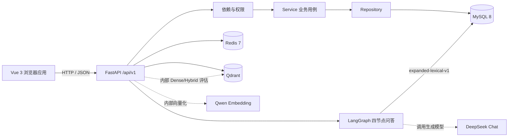
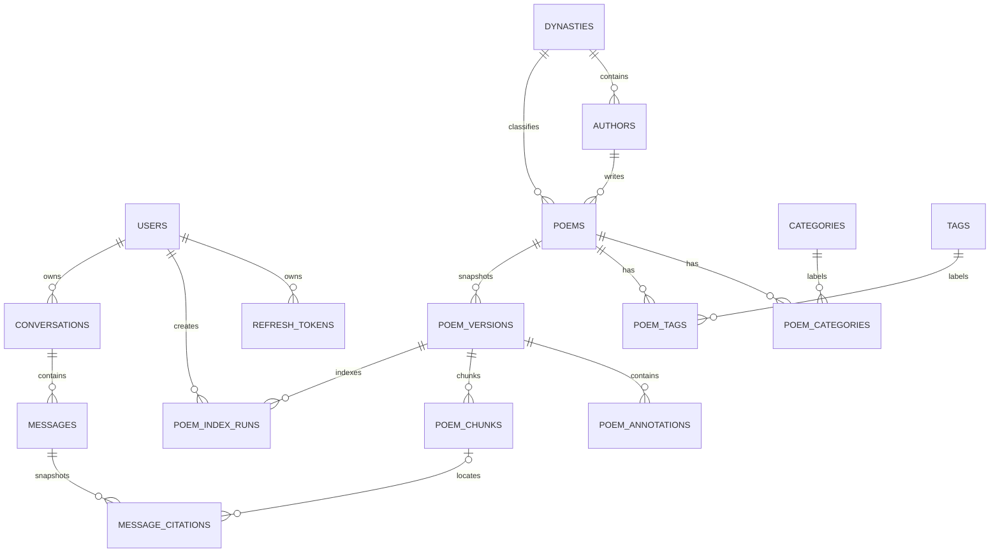

# 项目说明与代码导览

> 项目：Poem RAG  
> 文档状态：当前实现快照 v0.3  
> 更新日期：2026-09-20  
> 说明：本文件描述“现在是什么”，目标接口见 `FRONTEND_BACKEND_CONTRACT.md`

## 1. 一句话说明

Poem RAG 是一个面向诗词领域的全栈知识库与智能问答项目。当前版本已经完成用户、权限、诗词目录、会话持久化、带引用 SSE 问答和最小 LangGraph RAG 闭环，正在继续增强真实向量链路、检索策略和生成质量评估。

它当前更准确的定位是：

**诗词管理与浏览平台 + RAG 开发底座。**

当前问答已经接入最小四节点 LangGraph，并固定使用 `expanded-lexical-v1` 检索；Dense、Hybrid 和 Rerank 尚未切换为在线问答策略，生成模型也还没有完成真实账号联调。后续设计和实现不能把评估中能力或规划能力写成生产已实现成果。

## 2. 用户与核心流程

当前已实现的用户流程：

1. 游客浏览首页、诗词列表、诗词详情、作者列表和作者详情。
2. 游客按标题、作者或正文关键词搜索已发布诗词。
3. 用户注册、登录、刷新会话、退出和更新个人资料。
4. 管理员登录后管理诗词、作者、朝代和分类。
5. 管理员创建草稿、编辑、发布、撤回、软删除和恢复诗词。
6. 登录用户创建、切换和删除自己的问答会话。
7. 登录用户提交诗词问题，实时接收检索状态、回答增量、引用和完成事件。
8. 用户重新打开会话时读取已持久化的消息与引用快照。

后续目标流程：

1. 用户用自然语言查询出处、句意、意象、主题和相似诗句。
2. 系统检索诗句、整首作品、注释和赏析等证据。
3. 系统基于证据生成回答，展示原文引用和来源。
4. 证据不足时明确拒答或要求澄清，不编造出处和赏析。
5. 开发者用固定评估集比较切块、Embedding、检索、重排和生成策略。

## 3. 当前架构



当前架构选择：

1. 采用模块化单体，暂不拆微服务。
2. MySQL 是用户、权限和诗词业务数据的唯一事实来源。
3. Redis 用于健康检查，后续承担缓存、限流、短期状态和任务基础设施。
4. Qwen Embedding Provider、Qdrant 最小索引闭环、内部 Dense/Hybrid/查询改写检索和 DeepSeek Chat Provider 已实现；在线问答固定使用已评估的 `expanded-lexical-v1`，Dense/Hybrid 仍仅供内部 Service 与离线评估使用。
5. FastAPI Router 只处理 HTTP 映射，业务状态变化放在 Service，数据访问放在 Repository。
6. MySQL 保存会话、消息和引用快照；SSE 只负责传输过程状态，不成为长期数据源。

## 4. 仓库结构

```text
poem_project/
├─ apps/
│  ├─ api/                    FastAPI 异步后端
│  │  ├─ app/
│  │  │  ├─ api/              路由与依赖
│  │  │  ├─ core/             配置、错误、安全、响应、日志上下文
│  │  │  ├─ db/               数据库会话、Base、种子
│  │  │  ├─ models/           SQLAlchemy ORM 模型
│  │  │  ├─ repositories/     数据访问
│  │  │  ├─ schemas/          Pydantic 请求与响应
│  │  │  └─ services/         业务用例与事务编排
│  │  ├─ migrations/          Alembic 迁移
│  │  └─ tests/               后端测试
│  └─ web/                    Vue 3 前端
│     └─ src/
│        ├─ api/              统一 HTTP 客户端和接口模块
│        ├─ components/       通用组件
│        ├─ features/         领域组合逻辑
│        ├─ layouts/          页面布局
│        ├─ router/           页面路由与守卫
│        ├─ stores/           Pinia 状态
│        ├─ styles/           全局样式
│        ├─ types/            API 类型
│        └─ views/            页面
├─ docs/                      项目文档
├─ .env.example               环境变量模板
└─ README.md                  启动入口
```

## 5. 后端请求如何流转

以“公开诗词列表”为例：

```text
GET /api/v1/poems
  -> apps/api/app/api/v1/poems.py
  -> Depends(get_catalog_service)
  -> CatalogService
  -> PoemRepository
  -> SQLAlchemy AsyncSession
  -> MySQL
  -> success_response(...)
  -> Vue requestPage(...)
  -> PoemListView.vue
```

关键职责：

| 目录 | 职责 | 不应承担 |
| --- | --- | --- |
| `api/` | HTTP 参数、依赖、状态码、响应映射 | 复杂业务事务 |
| `services/` | 用例、权限规则、事务和跨仓储编排 | 直接处理 Vue 状态 |
| `repositories/` | 查询、写入、过滤与数据映射 | 决定用户是否能执行操作 |
| `schemas/` | 输入校验、输出结构和序列化 | 数据库查询 |
| `models/` | 表结构、关系和持久化字段 | HTTP 和页面逻辑 |
| `core/` | 配置、错误、安全、统一响应 | 某个具体业务用例 |

### 5.1 鉴权与权限

1. 访问令牌通过 `Authorization: Bearer <token>` 发送。
2. Refresh Token 使用 HttpOnly Cookie，并在刷新时轮换。
3. `get_current_user` 校验身份和账号状态。
4. `require_admin` 在用户身份之上校验管理员角色。
5. 前端路由守卫只决定是否展示页面，后端始终做最终授权。

### 5.2 统一响应

普通 JSON 接口使用统一 Envelope；`204`、文件和后续 SSE 流式接口属于例外。前端类型和错误码以 `FRONTEND_BACKEND_CONTRACT.md` 为准。

## 6. 当前数据模型



当前模型：

1. `users`：账号、密码哈希、角色和状态。
2. `refresh_tokens`：刷新令牌生命周期和轮换。
3. `dynasties`：朝代。
4. `authors`：作者及朝代关系。
5. `categories`：可扩展分类树。
6. `tags`：标签。
7. `poems`：标题、作者、朝代、正文、摘要、状态、版本和软删除。
8. `poem_categories`、`poem_tags`：诗词和分类、标签的多对多关系。

已实现的 RAG 语料基础模型：

1. `poem_sources`：人工、文件或后续爬取数据的来源证据。
2. `poem_versions`：诗词不可变版本快照和内容哈希。
3. `poem_annotations`：注释、译文、赏析、背景和典故。
4. `poem_chunks`：版本化文本切块和向量索引状态。
5. `poem_index_runs`：版本切块、Embedding 和向量写入的运行生命周期、配置快照与审计记录。

已实现的问答模型：

1. `conversations`：用户会话、标题、状态和最后消息时间。
2. `messages`：用户/助手消息、流式状态、模型、延迟和错误码。
3. `message_citations`：回答引用的作品、版本、注释、chunk、文本和排名快照。

尚未实现但已进入目标的模型包括意象和评估数据。结构化切块、MySQL 词法检索、Embedding Provider、Qdrant 最小索引闭环、内部 Dense/Hybrid 检索已经实现；在线问答固定使用 `expanded-lexical-v1`，不能把向量数据塞入现有 `poems.content`。

## 7. 前端页面地图

| 路由 | 页面 | 权限 |
| --- | --- | --- |
| `/` | 首页与诗词入口 | 公开 |
| `/poems` | 诗词列表 | 公开 |
| `/poems/:poemId` | 诗词详情 | 公开 |
| `/authors` | 作者列表 | 公开 |
| `/authors/:authorId` | 作者详情 | 公开 |
| `/search` | 搜索 | 公开 |
| `/chat`、`/chat/:conversationId` | 诗词问答与会话详情 | 登录 |
| `/login`、`/register` | 登录、注册 | 仅游客 |
| `/me` | 个人中心 | 登录 |
| `/admin/poems` | 诗词管理 | 管理员 |
| `/admin/catalog` | 目录管理 | 管理员 |
| `/403`、未知路径 | 无权限、404 | 公开 |

旧样例数据 `src/data/samplePoems.ts` 和对应搜索工具仍属于待清理技术债，不应作为新功能的参考模式。

## 8. 当前实现状态

| 能力 | 状态 | 说明 |
| --- | --- | --- |
| FastAPI 工程与统一响应 | 已实现 | 健康检查、异常处理、Request ID |
| 用户注册登录与权限 | 已实现 | JWT、Refresh Token、管理员依赖 |
| 朝代、作者、分类、标签 | 已实现 | 管理接口和公开读取 |
| 诗词 CRUD 与发布状态 | 已实现 | 草稿、发布、撤回、软删除、恢复 |
| 诗词公开浏览与基础搜索 | 已实现 | 基于 MySQL 的目录查询 |
| MySQL 迁移与种子 | 已实现 | Alembic head 为 `20260920_0005`，真实 MySQL 已升级 |
| Redis 健康检查 | 已实现 | 缓存和队列尚未使用 |
| 语料来源与版本快照 | 已实现 | 来源、不可变版本和编辑版本链已接入 |
| 结构化语料导入 | 已实现 | CLI 支持 JSON 预检、幂等创建/更新、逐条失败隔离、版本留痕和可选 chunk 重建；尚无 HTTP 导入任务 |
| 注释与 chunk 数据模型 | 已实现 | 支持 poem/line/note 粒度和向量索引状态 |
| 结构切块器 `structural-v1` | 已实现 | 支持版本级幂等重建；真实库已生成 21 个 pending chunks |
| 索引运行元数据 | 已实现 | 记录 `pending/running/succeeded/failed/cancelled` 状态和 `chunk/embed/upsert` 阶段；配置快照入库前脱敏；同一版本禁止重复活跃运行 |
| MySQL 可解释检索基线 | 已实现 | `lexical-baseline-v1` 从当前版本的 poem/line/note chunks 返回出处、行号、得分和 `match_types`；只读取已发布且未删除作品 |
| 索引任务 API 与 Worker | 未实现 | 当前只有 Service 和数据库记录，没有 HTTP 任务接口、租约、超时回收或取消 |
| 爬虫与任务化导入 | 未实现 | 结构化文件导入已实现；网站爬虫、上传接口、导入任务和 Worker 尚未实现 |
| Qwen Embedding Provider | 已实现（Provider 层） | 支持批量、维度、超时、有限重试和响应校验；已接入索引 Service，真实 DashScope 烟测已发起但被本地网络审批阻塞 |
| Qdrant 向量索引 | 已实现（最小闭环） | chunks -> Qwen Embedding -> Collection -> upsert -> chunk 映射；真实 Qdrant 1.19.1 已完成临时 Collection 烟测 |
| Dense 检索 | 已实现（内部 Service） | `dense-baseline-v1` 使用 Qdrant 召回，并回查 MySQL 校验当前版本、发布状态和注释可见性；Qdrant 已完成真实烟测，Qwen 索引和同集对比仍待完成 |
| 旧向量清理与 Qdrant 对账 | 未实现 | 尚未实现旧版本点清理、active index 切换和跨库全量对账 |
| Hybrid RRF 检索 | 已实现（内部 Service） | `hybrid-rrf-v1` 融合词法与 Dense 候选，按排名去重融合；尚未暴露 HTTP，Qdrant 烟测已通过，Qwen 和同集指标仍待完成 |
| 查询改写与多查询 RRF | 已实现（内部 Service） | `expanded-lexical-v1` 用可审查词典扩展月亮、思乡和已知作者实体，保留原查询并用 RRF 融合多路召回；真实 MySQL 种子集 Top-5 为 `27/27`，公开 HTTP 未切换 |
| 重排 | 未实现 | 已有 `lexical-baseline-v1`、`dense-baseline-v1`、`hybrid-rrf-v1` 和 `expanded-lexical-v1` 四条可比较路径 |
| 会话与消息持久化 | 已实现 | 会话、消息和引用快照写入 MySQL；按用户隔离会话所有权 |
| DeepSeek Chat Provider | 已实现（Provider 层） | 支持 OpenAI-compatible 流式 chat completions、超时、错误映射和空回答检测；真实 DeepSeek 账号尚未联调 |
| LangGraph 问答 | 已实现（最小闭环） | 四节点 `rewrite -> retrieve -> generate -> validate`；查询改写和检索使用 `expanded-lexical-v1` |
| SSE 引用问答 | 已实现 | `meta -> retrieval -> delta* -> citation* -> done/error`；持久化最终消息和引用，无证据时不调用模型 |
| RAG 评估体系 | 已实现（检索层） | 27 条可移植金标准样本；支持 Recall@k、MRR、Hit Rate、拒答和延迟；词法基线的 3 条自然语言查询失败已由 `expanded-lexical-v1` 在 6 首种子语料上修复 |
| 云服务器部署 | 未实现 | 核心 RAG 闭环后再处理域名和 HTTPS |

## 9. 如何追踪一个功能

阅读或修改功能时按以下路径进行：

1. 从前端 `router/routes.ts` 找到页面入口。
2. 从页面找到 `api/` 中对应模块。
3. 从接口路径找到后端 Router。
4. 查看 Dependency 如何校验身份和构造 Service。
5. 从 Service 读取业务规则和事务边界。
6. 从 Repository 读取查询条件、关联加载和分页。
7. 从 Model 和 Alembic 迁移确认数据约束。
8. 从测试确认已经保护的正常、边界和失败路径。
9. 从契约确认该行为是否属于稳定承诺。

## 10. 本地验证入口

后端：

```powershell
.\.venv\Scripts\python.exe -m pytest -q
.\.venv\Scripts\python.exe -m ruff check apps\api
.\.venv\Scripts\python.exe apps\api\scripts\import_corpus.py --input data\import\example_corpus_v1.json --dry-run
.\.venv\Scripts\python.exe apps\api\scripts\evaluate_retrieval.py --top-k 5
```

真实 Qdrant 已就绪，Qwen 配置确认后，可额外执行内部 Dense 评估：

```powershell
.\.venv\Scripts\python.exe apps\api\scripts\evaluate_retrieval.py --strategy dense --top-k 5
```

同一环境也可以执行内部 Hybrid RRF 评估：

```powershell
.\.venv\Scripts\python.exe apps\api\scripts\evaluate_retrieval.py --strategy hybrid --top-k 5
```

Qdrant 适配器真实烟测：

```powershell
.\.venv\Scripts\python.exe apps\api\scripts\smoke_qdrant.py
```

该脚本使用随机临时 Collection，验证维度不匹配拒绝、upsert、过滤检索和删除，
最后删除测试 Collection，不写入正式 `poem_chunks_v1`。

Qwen Embedding 真实烟测：

```powershell
.\.venv\Scripts\python.exe apps\api\scripts\smoke_qwen_embedding.py --text 明月
```

该脚本只输出模型、配置维度、实际维度和向量范数，不输出向量或 Key。需要可用的
DashScope 网络环境；当前本机沙箱网络失败，外网审批连续遇到审核服务故障。
若自动审批持续不可用，可由用户在本机终端手动执行该命令。

DeepSeek 流式烟测：

```powershell
.\.venv\Scripts\python.exe apps\api\scripts\smoke_deepseek_chat.py
```

该脚本使用一个短提示词验证真实 Chat Provider 的流式链路，只输出模型 ID、增量片段数、
字符数和耗时，不输出完整回答或 Key。

真实 chunk 索引：

```powershell
.\.venv\Scripts\python.exe apps\api\scripts\index_chunks.py --all-pending
.\.venv\Scripts\python.exe apps\api\scripts\index_chunks.py --version-id 1
```

该命令默认复用已有 `structural-v1` chunks，不重建切块；每个版本会通过
`IndexingService` 完成 Embedding、Qdrant upsert 和 MySQL 回写，并保留索引运行记录。
只有 Qwen 和 Qdrant 均可用时才应执行。

不依赖 Qdrant 或 Qwen 的内部查询改写评估：

```powershell
.\.venv\Scripts\python.exe apps\api\scripts\evaluate_retrieval.py --strategy expanded --top-k 5
```

`expanded-lexical-v1` 只在内部 Service 和离线评估中使用；公开
`GET /api/v1/search/evidence` 仍固定为 `lexical-baseline-v1`。

前端：

```powershell
pnpm --dir apps\web typecheck
pnpm --dir apps\web test
pnpm --dir apps\web build
```

真实联调前确认：

1. MySQL 监听 `3306`，Alembic 已升级到 head。
2. Redis 监听 `6379`。
3. FastAPI 运行在 `http://127.0.0.1:8000`。
4. Vite 运行在 `http://127.0.0.1:5173`。
5. `/api/v1/health/ready` 返回 `200`。

## 11. 术语表

| 术语 | 在本项目中的含义 |
| --- | --- |
| 作品/诗词 | 一首诗、词或曲的完整作品 |
| 诗句/联句 | 检索与引用使用的较小文本单位 |
| chunk | 进入索引的文本块，不代表唯一一种粒度 |
| poem card | 整首短诗及其结构化元数据 |
| line card | 诗句或联句及其出处信息 |
| note card | 注释、译文或赏析及其关联行范围 |
| 检索 | 从语料中找出相关证据，不生成答案 |
| 生成 | 基于检索证据组织自然语言回答 |
| 引用 | 回答中指向作品、诗句和来源的可验证依据 |
| 评估集 | 固定问题、标准答案、金标准证据和判定规则 |
| ADR | 记录重要架构选择和取舍的决策文档 |
