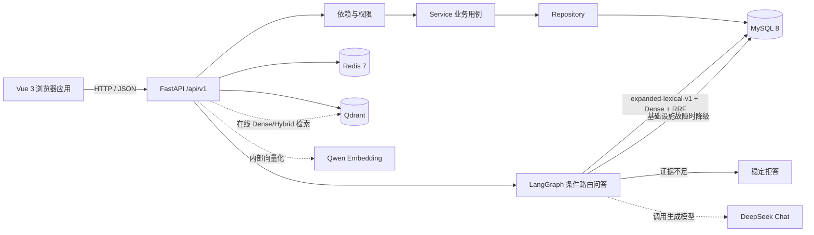
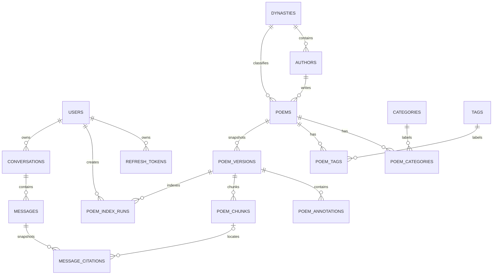

# 项目说明与代码导览

> 项目：Poem RAG  
> 文档状态：当前实现快照 v0.8.0-retrieval-2-evaluation
> 更新日期：2026-09-26
> 说明：本文件描述“现在是什么”，目标接口见 `FRONTEND_BACKEND_CONTRACT.md`

## 1. 一句话说明

Poem RAG 是一个面向诗词领域的全栈知识库与智能问答项目。当前版本已经完成用户、权限、诗词目录、会话持久化、带引用 SSE 问答和最小 LangGraph RAG 闭环，正在继续增强真实向量链路、检索策略和生成质量评估。

它当前更准确的定位是：

**诗词管理与浏览平台 + RAG 开发底座。**

当前问答已经接入带条件路由的 LangGraph，流程为
`rewrite -> retrieve -> assess -> generate|refuse -> validate`。在线检索使用
`expanded-lexical-v1 + Dense + RRF`，公开策略名为 `hybrid-rrf-v1`；Qdrant 或
Embedding 基础设施故障时降级到 `expanded-lexical-v1`。`assess` 已接入 DeepSeek
非流式 JSON 结构化判定，Provider 已完成真实 `deepseek-chat` 流式与 JSON 烟测，
并完成真实 MySQL + SSE 基础在线联调：有证据问题返回带引用回答，无答案问题稳定拒答
且不产生引用。后续设计和实现不能把评估中能力或规划能力写成生产已实现成果。

## 2. 用户与核心流程

当前已实现的用户流程：

1. 游客浏览首页、诗词列表、诗词详情、作者列表和作者详情。
2. 游客按标题、作者或正文关键词搜索已发布诗词。
3. 用户注册、登录、刷新会话、退出和更新个人资料。
4. 管理员登录后管理诗词、作者、朝代和分类。
5. 管理员创建草稿、编辑、发布、撤回、软删除和恢复诗词。
6. 登录用户创建、切换和删除自己的问答会话。
7. 登录用户提交诗词问题，实时接收检索状态、回答增量、引用和完成事件。
8. 用户重新打开会话时读取已持久化的消息与引用快照。

后续目标流程：

1. 用户用自然语言查询出处、句意、意象、主题和相似诗句。
2. 系统检索诗句、整首作品、注释和赏析等证据。
3. 系统基于证据生成回答，展示原文引用和来源。
4. 证据不足时明确拒答或要求澄清，不编造出处和赏析。
5. 开发者用固定评估集比较切块、Embedding、检索、重排和生成策略。

## 3. 当前架构



当前架构选择：

1. 采用模块化单体，暂不拆微服务。
2. MySQL 是用户、权限和诗词业务数据的唯一事实来源。
3. Redis 用于健康检查，后续承担缓存、限流、短期状态和任务基础设施。
4. Qwen Embedding Provider、Qdrant 最小索引闭环、Dense/Hybrid/查询改写检索和 DeepSeek Chat Provider 已实现；固定来源语料已扩展到 1000 首并完成真实索引。加权 RRF v2 在 v1 检索回归集上，在线组合达到 50/50；在第二批独立 holdout v2 上，在线组合从 40/46 提升到 45/46，生成 holdout 从 24/26 提升到 26/26。第三批独立 holdout v3 上，在线检索为 45/46、Recall@5 `1.0`、MRR `0.929825`，生成为 25/26、拒答 `10/10`。在线问答使用 `expanded-lexical-v1 + Dense + RRF`，并通过 `CHAT_DENSE_MIN_SCORE=0.60` 控制 Dense 候选下限：`poem`/`line` 主文本允许 `0.02` 容差，`note` 仍严格使用该阈值。Qdrant 或 Embedding 构造失败时降级到 `expanded-lexical-v1`，运行期仅对 `EMBEDDING_PROVIDER_ERROR` 和 `VECTOR_STORE_ERROR` 降级。Dense 门槛只能防跨域漂移，领域内“话题命中、答案缺失”的样本由 `assess` 节点通过 LLM 结构化输出判定；判定失败时 fail-open 继续生成，引用校验仍作为兜底。在线图同时记录各阶段内部耗时，`CHAT_QUERY_VARIANT_LIMIT=8` 限制查询扩展分支；指标只进入服务端日志，不改变公开 SSE。在线检索进一步复用进程级 Embedding 与 Qdrant 客户端，并把一次查询的全部变体合并为一次 Embedding 调用；同一 v2 回归集下检索质量不变，平均延迟从 `874.575 ms` 降到 `483.760 ms`。
5. FastAPI Router 只处理 HTTP 映射，业务状态变化放在 Service，数据访问放在 Repository。
6. MySQL 保存会话、消息和引用快照；SSE 只负责传输过程状态，不成为长期数据源。

## 4. 仓库结构

```text
poem_project/
├─ apps/
│  ├─ api/                    FastAPI 异步后端
│  │  ├─ app/
│  │  │  ├─ api/              路由与依赖
│  │  │  ├─ core/             配置、错误、安全、响应、日志上下文
│  │  │  ├─ db/               数据库会话、Base、种子
│  │  │  ├─ models/           SQLAlchemy ORM 模型
│  │  │  ├─ repositories/     数据访问
│  │  │  ├─ schemas/          Pydantic 请求与响应
│  │  │  └─ services/         业务用例与事务编排
│  │  ├─ migrations/          Alembic 迁移
│  │  └─ tests/               后端测试
│  └─ web/                    Vue 3 前端
│     └─ src/
│        ├─ api/              统一 HTTP 客户端和接口模块
│        ├─ components/       通用组件
│        ├─ features/         领域组合逻辑
│        ├─ layouts/          页面布局
│        ├─ router/           页面路由与守卫
│        ├─ stores/           Pinia 状态
│        ├─ styles/           全局样式
│        ├─ types/            API 类型
│        └─ views/            页面
├─ docs/                      项目文档
├─ .env.example               环境变量模板
└─ README.md                  启动入口
```

## 5. 后端请求如何流转

以“公开诗词列表”为例：

```text
GET /api/v1/poems
  -> apps/api/app/api/v1/poems.py
  -> Depends(get_catalog_service)
  -> CatalogService
  -> PoemRepository
  -> SQLAlchemy AsyncSession
  -> MySQL
  -> success_response(...)
  -> Vue requestPage(...)
  -> PoemListView.vue
```

关键职责：

| 目录 | 职责 | 不应承担 |
| --- | --- | --- |
| `api/` | HTTP 参数、依赖、状态码、响应映射 | 复杂业务事务 |
| `services/` | 用例、权限规则、事务和跨仓储编排 | 直接处理 Vue 状态 |
| `repositories/` | 查询、写入、过滤与数据映射 | 决定用户是否能执行操作 |
| `schemas/` | 输入校验、输出结构和序列化 | 数据库查询 |
| `models/` | 表结构、关系和持久化字段 | HTTP 和页面逻辑 |
| `core/` | 配置、错误、安全、统一响应 | 某个具体业务用例 |

### 5.1 鉴权与权限

1. 访问令牌通过 `Authorization: Bearer <token>` 发送。
2. Refresh Token 使用 HttpOnly Cookie，并在刷新时轮换。
3. `get_current_user` 校验身份和账号状态。
4. `require_admin` 在用户身份之上校验管理员角色。
5. 前端路由守卫只决定是否展示页面，后端始终做最终授权。

### 5.2 统一响应

普通 JSON 接口使用统一 Envelope；`204`、文件和后续 SSE 流式接口属于例外。前端类型和错误码以 `FRONTEND_BACKEND_CONTRACT.md` 为准。

## 6. 当前数据模型



当前模型：

1. `users`：账号、密码哈希、角色和状态。
2. `refresh_tokens`：刷新令牌生命周期和轮换。
3. `dynasties`：朝代。
4. `authors`：作者及朝代关系。
5. `categories`：可扩展分类树。
6. `tags`：标签。
7. `poems`：标题、作者、朝代、正文、摘要、状态、版本和软删除。
8. `poem_categories`、`poem_tags`：诗词和分类、标签的多对多关系。

已实现的 RAG 语料基础模型：

1. `poem_sources`：人工、文件或后续爬取数据的来源证据。
2. `poem_versions`：诗词不可变版本快照和内容哈希。
3. `poem_annotations`：注释、译文、赏析、背景和典故。
4. `poem_chunks`：版本化文本切块和向量索引状态。
5. `poem_index_runs`：版本切块、Embedding 和向量写入的运行生命周期、配置快照与审计记录。

已实现的问答模型：

1. `conversations`：用户会话、标题、状态和最后消息时间。
2. `messages`：用户/助手消息、流式状态、模型、延迟和错误码。
3. `message_citations`：回答引用的作品、版本、注释、chunk、文本和排名快照。

尚未实现但已进入目标的模型包括意象和评估数据。结构化切块、MySQL 词法检索、Embedding Provider、Qdrant 最小索引闭环、Dense/Hybrid 在线检索已经实现；真实库现有 1008 首已发布作品、1009 个作品版本和 12415 个 chunks。固定来源的 1000 首分层语料完成 902 个新建和 98 个未变化导入，所有 chunks 均已使用 1024 维 Qwen 向量写入 Qdrant。在线问答使用 Hybrid RRF，并在基础设施故障时降级到查询扩展词法检索；不能把向量数据塞入现有 `poems.content`。

## 7. 前端页面地图

| 路由 | 页面 | 权限 |
| --- | --- | --- |
| `/` | 首页与诗词入口 | 公开 |
| `/poems` | 诗词列表 | 公开 |
| `/poems/:poemId` | 诗词详情 | 公开 |
| `/authors` | 作者列表 | 公开 |
| `/authors/:authorId` | 作者详情 | 公开 |
| `/search` | 搜索 | 公开 |
| `/chat`、`/chat/:conversationId` | 诗词问答与会话详情 | 登录 |
| `/login`、`/register` | 登录、注册 | 仅游客 |
| `/me` | 个人中心 | 登录 |
| `/admin/poems` | 诗词管理 | 管理员 |
| `/admin/catalog` | 目录管理 | 管理员 |
| `/403`、未知路径 | 无权限、404 | 公开 |

旧样例数据 `src/data/samplePoems.ts` 和对应搜索工具仍属于待清理技术债，不应作为新功能的参考模式。

## 8. 当前实现状态

| 能力 | 状态 | 说明 |
| --- | --- | --- |
| FastAPI 工程与统一响应 | 已实现 | 健康检查、异常处理、Request ID |
| 用户注册登录与权限 | 已实现 | JWT、Refresh Token、管理员依赖 |
| 朝代、作者、分类、标签 | 已实现 | 管理接口和公开读取 |
| 诗词 CRUD 与发布状态 | 已实现 | 草稿、发布、撤回、软删除、恢复 |
| 诗词公开浏览与基础搜索 | 已实现 | 基于 MySQL 的目录查询 |
| MySQL 迁移与种子 | 已实现 | Alembic head 为 `20260920_0005`，真实 MySQL 已升级 |
| Redis 健康检查 | 已实现 | 缓存和队列尚未使用 |
| 语料来源与版本快照 | 已实现 | 来源、不可变版本和编辑版本链已接入 |
| 结构化语料导入 | 已实现 | CLI 支持 JSON 预检、幂等创建/更新、逐条失败隔离、版本留痕和可选 chunk 重建；固定来源已扩展到 1000 首，真实结果为 902 created、98 unchanged、0 failed；尚无 HTTP 导入任务 |
| 注释与 chunk 数据模型 | 已实现 | 支持 poem/line/note 粒度和向量索引状态 |
| 结构切块器 `structural-v1` | 已实现 | 支持版本级幂等重建；真实库现有 12415 个 chunks，扩库新增 10346 个并全部完成向量索引 |
| 索引运行元数据 | 已实现 | 记录 `pending/running/succeeded/failed/cancelled` 状态和 `chunk/embed/upsert` 阶段；配置快照入库前脱敏；同一版本禁止重复活跃运行 |
| MySQL 可解释检索基线 | 已实现 | `lexical-baseline-v1` 从当前版本的 poem/line/note chunks 返回出处、行号、得分和 `match_types`；只读取已发布且未删除作品 |
| 索引任务 API 与 Worker | 未实现 | 当前只有 Service 和数据库记录，没有 HTTP 任务接口、租约、超时回收或取消 |
| 爬虫与任务化导入 | 未实现 | 结构化文件导入已实现；网站爬虫、上传接口、导入任务和 Worker 尚未实现 |
| Qwen Embedding Provider | 已实现（Provider 层） | 支持批量、维度、超时、有限重试和响应校验；已接入索引 Service，真实 DashScope 烟测已通过 |
| Qdrant 向量索引 | 已实现（最小闭环） | chunks -> Qwen Embedding -> Collection -> upsert -> chunk 映射；真实 Qdrant 1.19.1 已完成临时 Collection 烟测 |
| Dense 检索 | 已实现（在线分支） | `dense-baseline-v1` 使用 Qdrant 召回，并回查 MySQL 校验当前版本、发布状态和注释可见性；在线问答使用 `CHAT_DENSE_MIN_SCORE=0.60`，`poem`/`line` 主文本允许 `0.02` 容差、`note` 无容差，低于有效门槛的候选在检索层丢弃 |
| 旧向量清理与 Qdrant 对账 | 未实现 | 尚未实现旧版本点清理、active index 切换和跨库全量对账 |
| Hybrid RRF 检索 | 已实现（在线策略） | 加权 `hybrid-rrf-v1` 融合 `expanded-lexical-v1` 与 Dense 候选，按查询来源权重和排名去重融合；v1 回归集 Top-5 为 50/50、Recall@5 `1.0`、MRR `0.887698`；v2 独立 holdout 为 45/46、Recall@5 `1.0`、MRR `0.907895`；v3 独立 holdout 为 45/46、Recall@5 `1.0`、MRR `0.929825`。公开 HTTP 检索仍不暴露策略参数 |
| 查询改写与多查询 RRF | 已实现（在线分支与降级策略） | `expanded-lexical-v1` 用可审查词典扩展月亮、思乡、元宵、怀人、白发夸张和已知作者实体，保留原查询并用加权 RRF 融合多路召回；显式标题会保留完整作品槽位，多标题查询优先完整作品块，结构化主题查询保留正文候选，多证据问题会限制单个作品占用的候选槽位；v2 独立 holdout Top-5 为 38/46，v3 为 44/46 |
| 重排 | 离线框架已实现；确定性策略未达切换门槛；在线未启用 | 新增 `EvidenceReranker`、`RerankedRetrievalService`、`expanded-hybrid-rerank-v1` 和 nDCG@k；`deterministic-evidence-v1` 在 v4 泛化集为 38/46、Recall@5 `0.828947`、nDCG@5 `0.776326`、MRR `0.757456`，低于不重排基线的 45/46、`1.0`、`0.915410`、`0.885965`，因此仅保留离线实验能力 |
| 会话与消息持久化 | 已实现 | 会话、消息和引用快照写入 MySQL；按用户隔离会话所有权 |
| DeepSeek Chat Provider | 已实现（Provider 层） | 支持 OpenAI-compatible 流式与非流式 JSON chat completions、超时、错误映射和空回答检测；真实 `deepseek-chat` 流式与 JSON 烟测、真实 MySQL + SSE 基础联调均已通过 |
| LangGraph 问答 | 已实现（条件路由） | `rewrite -> retrieve -> assess -> generate|refuse -> validate`；在线检索使用 `expanded-lexical-v1 + Dense + RRF`，基础设施故障时降级到 `expanded-lexical-v1`；命中作品追加诗词级父级上下文，长文本按作品轮转并受 40 chunks / 4800 字符预算约束；`assess` 用 LLM 结构化判定可答性，无证据或判定不可答时走 `refuse` 且不调用生成模型；判定异常 fail-open |
| 在线 RAG 可观测性 | 已实现 | 图节点在 `finally` 中发出内部 `timing`，`ChatService` 聚合 `rewrite/retrieval/assess/generation/validate`、TTFT、候选数、策略和判定状态；流结束记录请求级日志。`timing` 不进入公开 SSE，`done` 仍为 `{finish_reason, latency_ms}`；`CHAT_QUERY_VARIANT_LIMIT` 默认 `8`、范围 `1-20` |
| 在线检索资源复用与批量 Embedding | 已实现 | Embedding Provider 和 Qdrant 客户端在应用 `lifespan` 中创建并共享，流结束不再重复初始化；`BatchEvidenceRetriever` 协议让一次查询的全部变体合并为一次 Embedding 调用，跨变体向量 ID 回查合并为一次 MySQL 查询。Qdrant 搜索仍按变体串行，因为 `AsyncSession` 不能并发复用。同一 v2 回归集下检索仍为 45/46、MRR `0.907895`，平均延迟 `874.575 ms -> 483.760 ms`、P95 `2770.212 ms -> 1239.925 ms` |
| 生成性能与有界并发评估 | 已实现（仅离线评估） | 生成评估报告新增 TTFT、五阶段平均/P95、wall time 和吞吐；`evaluate_generation.py --concurrency` 默认 `1`，用信号量限制同时执行的样本并保持结果顺序。v3 真实 `c1 -> c4`：吞吐 `0.269 -> 0.644 cases/s`，质量保持 `25/26`、拒答 `10/10`、引用 P/R `1.0 / 1.0`，但平均延迟 `3711.359 -> 5888.418 ms`、平均 TTFT `2602.745 -> 4291.510 ms`。该参数不接入在线服务 |
| SSE 引用问答 | 已实现 | `meta -> retrieval -> delta* -> citation* -> done/error`；持久化最终消息和引用，无证据时不调用模型 |
| RAG 评估体系 | 已实现（检索层 + 生成层 + 离线 judge/校准） | v1 回归集 50 条中 `expanded-lexical-v1` 为 48/50、Hybrid 为 40/50、在线组合为 50/50；生成回归集 28 条为 `28/28`、拒答 `7/7`。v2 独立 holdout 检索 46 条中在线组合为 45/46、Recall@5 `1.0`、MRR `0.907895`，生成 26 条为 `26/26`、拒答 `10/10`、引用 P/R 均为 `1.0`。v3 独立 holdout 检索 46 条中在线组合为 45/46、Recall@5 `1.0`、nDCG@5 `0.947993`、MRR `0.929825`，生成 26 条为 `25/26`、拒答 `10/10`、引用 P/R `1.0 / 1.0`。v4 检索 holdout 46 条（38 有答案 + 8 无答案）首次用于 Rerank 泛化验证：不重排基线为 45/46、Recall@5 `1.0`、nDCG@5 `0.915410`、MRR `0.885965`；`deterministic-evidence-v1` 未达标，已拒绝在线启用。v3 的可答样本进一步由独立 LLM judge 复核：16/16 完成、0 错误、忠实度通过率 `0.8125`、相关性 `1.0`、claim 支撑率 `0.950920`；首次人工校准覆盖 3/16，`judge_stricter=3`。四批样本都已参与失败观察或策略筛选，只能作为回归集 |
| 云服务器部署 | 未实现 | 核心 RAG 闭环后再处理域名和 HTTPS |

## 9. 如何追踪一个功能

阅读或修改功能时按以下路径进行：

1. 从前端 `router/routes.ts` 找到页面入口。
2. 从页面找到 `api/` 中对应模块。
3. 从接口路径找到后端 Router。
4. 查看 Dependency 如何校验身份和构造 Service。
5. 从 Service 读取业务规则和事务边界。
6. 从 Repository 读取查询条件、关联加载和分页。
7. 从 Model 和 Alembic 迁移确认数据约束。
8. 从测试确认已经保护的正常、边界和失败路径。
9. 从契约确认该行为是否属于稳定承诺。

## 10. 本地验证入口

后端：

```powershell
.\.venv\Scripts\python.exe -m pytest -q
.\.venv\Scripts\python.exe -m ruff check apps\api
.\.venv\Scripts\python.exe apps\api\scripts\import_corpus.py --input data\import\example_corpus_v1.json --dry-run
.\.venv\Scripts\python.exe apps\api\scripts\evaluate_retrieval.py --top-k 5
```

固定来源 1000 首语料转换、导入与索引：

```powershell
.\.venv\Scripts\python.exe apps\api\scripts\convert_chinese_gushiwen.py `
  --input-dir data\raw\aopao-chinese-gushiwen-c2345d0 `
  --limit 1000 `
  --publish
.\.venv\Scripts\python.exe apps\api\scripts\import_corpus.py `
  --input data\import\generated\chinese-gushiwen-1000-v2.json `
  --report data\import\reports\chinese-gushiwen-1000-v2.import.json `
  --rebuild-chunks
.\.venv\Scripts\python.exe apps\api\scripts\index_chunks.py --all-pending
```

本次验证结果：902 首新建、98 首未变化、0 失败，新增 10346 个 chunks；真实库共
1008 首已发布作品、12415 个 chunks，Qdrant 共 12415 points、1024 维且状态为
`green`。`indexed_vectors_count=0` 仍不能单独判定为故障，当前查询正常，但需要在
更大规模前单独验证 HNSW 参数。来源、10 分片筛选、评估与许可边界见
`docs/features/20260923-chinese-gushiwen-1000-corpus.md`。

真实 Qdrant 和 Qwen 已就绪，可执行内部 Dense 评估：

```powershell
.\.venv\Scripts\python.exe apps\api\scripts\evaluate_retrieval.py --strategy dense --top-k 5
```

同一环境也可以执行内部 Hybrid RRF 评估：

```powershell
.\.venv\Scripts\python.exe apps\api\scripts\evaluate_retrieval.py --strategy hybrid --top-k 5
```

生成层评估需要真实 Chat Provider，直接运行在线图：

```powershell
.\.venv\Scripts\python.exe apps\api\scripts\evaluate_generation.py `
  --json-output data\eval\reports\generation_holdout_1000_v1_after_weighting_v2.json
```

默认数据集 `data/eval/generation_holdout_1000_v1.json` 共 28 条，指标包括答案
正确率、引用精确率/召回率、拒答 P/R/F1、总延迟、TTFT、五阶段耗时、wall time
和吞吐。`--concurrency` 默认 `1`，只限制离线评估同时执行的样本数，不接入在线服务。
每个样本使用独立 Session，单样本异常不会中断整份报告。该数据集当前回归结果为 `28/28`、拒答 `7/7`，
有答案准确率 `1.0`、拒答 P/R/F1 `1.0`、引用精确率 `0.971429`、
引用召回率 `1.0`，平均延迟 `5687.155 ms`、P95 `9481.742 ms`。多证据问题平均
`8817.328 ms`、P95 `9940.227 ms`，是当前主要性能瓶颈。旧 12 条种子集仍可通过
`--dataset data\eval\generation_rag_v1.json` 复现。评估结果仍不能替代人工忠实度
复核。

v3 的串行与有界并发对照：

```powershell
.\.venv\Scripts\python.exe apps\api\scripts\evaluate_generation.py `
  --dataset data\eval\generation_holdout_1000_v3.json `
  --concurrency 1 `
  --json-output data\eval\reports\generation_holdout_1000_v3_performance_c1.json

.\.venv\Scripts\python.exe apps\api\scripts\evaluate_generation.py `
  --dataset data\eval\generation_holdout_1000_v3.json `
  --concurrency 4 `
  --json-output data\eval\reports\generation_holdout_1000_v3_performance_c4.json
```

生成报告的离线质量 judge：

```powershell
.\.venv\Scripts\python.exe apps\api\scripts\judge_generation.py `
  --json-output data\eval\reports\generation_holdout_1000_v3_judge.json `
  --review-output data\eval\reports\generation_holdout_1000_v3_blind_review.md
```

judge 读取已有报告，不重新执行检索或生成。总体忠实度由事实声明的支撑状态确定性推导，
引用 rank 按实际证据集合校验；拒答、空回答和生成错误直接跳过。每个可答样本增加一次
`deepseek-chat` 调用，单样本失败会记录 `INVALID_JUDGE_RESPONSE` 等错误码并继续。当前
v3 的 16 条可答样本为 `judge_errors=0`、忠实度通过率 `0.8125`、相关性 `1.0`、claim
支撑率 `0.950920`；三条部分支撑样本已完成人工盲评校准。详细契约见
[生成质量 LLM-as-judge](features/20260924-generation-judge.md)。

人工校准与 judge 共用同一份离线报告，不重新调用模型：

```powershell
.\.venv\Scripts\python.exe apps\api\scripts\calibrate_generation_judge.py `
  --export-template data\eval\reports\generation_holdout_1000_v3_calibration.csv `
  --review-output data\eval\reports\generation_holdout_1000_v3_calibration_review.md

.\.venv\Scripts\python.exe apps\api\scripts\calibrate_generation_judge.py `
  --review-input data\eval\reports\generation_holdout_1000_v3_calibration.csv `
  --json-output data\eval\reports\generation_holdout_1000_v3_calibration.json `
  --summary-output data\eval\reports\generation_holdout_1000_v3_calibration_summary.md
```

第一条命令只导出人工盲评模板；第二条命令读取人工填写的 `relevance_0_2` 和
`faithfulness_0_2`，自动计算相关性/忠实度精确一致率、严格通过一致率，以及
`judge_stricter`、`judge_looser` 分歧数量。人工字段必须是裸数值 `0/1/2`。首次复核
3/16 条 judge 成功样本，覆盖率 `0.187500`，相关性精确一致率 `1.0`、忠实度精确一致率
`0.0`、严格通过一致率 `0.0`，`judge_stricter=3`、`judge_looser=0`。这组样本全部来自
`judge_failure_case_ids`，只能支持“judge 对隐含文学解释偏保守”的定向结论，不能代表
judge 的总体准确率。

Dense 和 Hybrid 可额外传入余弦相似度下限，低于门槛的候选会被丢弃，用于验证拒答行为：

```powershell
.\.venv\Scripts\python.exe apps\api\scripts\evaluate_retrieval.py `
  --strategy hybrid --min-score 0.60 --top-k 5
```

`dense`、`hybrid` 和 `expanded-hybrid` 未显式传 `--min-score` 时，现在会读取线上
`CHAT_DENSE_MIN_SCORE`，避免离线报告与在线口径分裂。命令中保留 `0.60` 是为了显式
复现当前线上阈值；需要做阈值诊断时仍可传入其他值或 `0`。

评估报告可保存到 `data/eval/reports/`。现行默认数据集是
`data/eval/retrieval_open_corpus_v1.json`（`open-corpus-100-v1`，50 条）；
复现历史种子集报告时显式传入 `--dataset`：

```powershell
.\.venv\Scripts\python.exe apps\api\scripts\evaluate_retrieval.py `
  --dataset data\eval\retrieval_lexical_v2.json --top-k 5
```

在 1000 首候选池上重跑旧 50 条集时，Hybrid + `0.60` 为 `43/50`、
Recall@5 `0.952381`、MRR `0.888889`，无答案准确率只有 `0.5`；词法基线为
`36/50`，`expanded-lexical-v1` 为 `34/50`。新增语料明显挤压多证据和领域内拒答，
该集合不能继续承担阈值调参；完整历史指标见
`docs/features/20260923-chinese-gushiwen-1000-corpus.md`。

独立 holdout 的复现命令和同集结果见
`docs/features/20260923-independent-1000-holdout.md`。当前在线组合为
`expanded-lexical-v1 + Dense + RRF`，公开 HTTP 检索仍固定为词法基线。该批 50/28
条样本已经参与失败诊断和修复，后续只能作为回归集，不能再作为未观察泛化证据。

第二批独立 holdout 见 `docs/features/20260924-independent-1000-holdout-v2.md`。
检索 46 条（38 有答案 + 8 无答案）、生成 26 条（16 有答案 + 10 拒答），问题与 v1
完全不重叠。复现命令：

```powershell
.\.venv\Scripts\python.exe apps\api\scripts\evaluate_retrieval.py `
  --dataset data\eval\retrieval_holdout_1000_v2.json `
  --strategy expanded-hybrid --top-k 5 --min-score 0.60 `
  --json-output data\eval\reports\retrieval_holdout_1000_v2_expanded_hybrid_final.json

.\.venv\Scripts\python.exe apps\api\scripts\evaluate_generation.py `
  --dataset data\eval\generation_holdout_1000_v2.json `
  --json-output data\eval\reports\generation_holdout_1000_v2_after_retrieval_fixes.json
```

同集结果：检索在线组合 45/46、Recall@5 `1.0`、MRR `0.907895`、无答案准确率
`0.875`，唯一失败为领域内缺属性的 `no-answer-v2-xinqiji-office-08`；生成 `26/26`、
拒答 `10/10`、引用 P/R 均为 `1.0`，平均延迟 `4699.931 ms`、P95 `8422.616 ms`。
v2 样本同样已经参与失败诊断，只能作为回归集。

第三批独立 holdout 见
`docs/features/20260924-independent-1000-holdout-v3.md`。检索 46 条、生成 26 条，
问题文本与 v1/v2 完全不重叠。复现命令：

```powershell
.\.venv\Scripts\python.exe apps\api\scripts\evaluate_retrieval.py `
  --dataset data\eval\retrieval_holdout_1000_v3.json `
  --strategy expanded-hybrid --top-k 5 --min-score 0.60 `
  --json-output data\eval\reports\retrieval_holdout_1000_v3_expanded_hybrid.json

.\.venv\Scripts\python.exe apps\api\scripts\evaluate_generation.py `
  --dataset data\eval\generation_holdout_1000_v3.json `
  --json-output data\eval\reports\generation_holdout_1000_v3.json
```

同集结果：检索在线组合 45/46、Recall@5 `1.0`、MRR `0.929825`、无答案准确率
`0.875`，唯一失败为领域内缺属性的 `no-answer-v3-dufu-death-year-08`；生成 `25/26`、
有答案准确率 `0.9375`、拒答 `10/10`、引用 P/R `1.0 / 1.0`，唯一失败为
`gen-v3-guazhou-homesick`，缺少距离铺垫事实。v3 已经完成真实观察，后续只能作为
回归集，新的泛化结论必须使用 v4。

第四批 `retrieval-holdout-1000-v4`（46 条，38 有答案 + 8 无答案）首次用于离线
Rerank 泛化验证，`nDCG@5` 与唯一 Gold 匹配口径同时加入评估。复现命令：

```powershell
.\.venv\Scripts\python.exe apps\api\scripts\evaluate_retrieval.py `
  --dataset data\eval\retrieval_holdout_1000_v4.json `
  --strategy expanded-hybrid --top-k 5 --min-score 0.60 `
  --json-output data\eval\reports\retrieval_holdout_1000_v4_expanded_hybrid.json

.\.venv\Scripts\python.exe apps\api\scripts\evaluate_retrieval.py `
  --dataset data\eval\retrieval_holdout_1000_v4.json `
  --strategy expanded-hybrid-rerank --top-k 5 --min-score 0.60 `
  --rerank-candidate-limit 30 `
  --json-output data\eval\reports\retrieval_holdout_1000_v4_expanded_hybrid_rerank.json
```

同集结果：不重排基线为 45/46、Recall@5 `1.0`、nDCG@5 `0.915410`、MRR `0.885965`、
平均延迟 `543.553 ms`、P95 `1361.468 ms`；`deterministic-evidence-v1` 为 38/46、
Recall@5 `0.828947`、nDCG@5 `0.776326`、MRR `0.757456`、平均延迟 `550.844 ms`、
P95 `1285.898 ms`。Top-10 和 Top-5 候选消融仍分别只有 41/46 和 45/46，MRR/nDCG
低于基线，因此拒绝在线启用。Rerank 代码只保留为离线实验能力，在线策略仍为
`expanded-hybrid-rrf-v1`；v4 已观察，后续再验证需冻结 v5。详细边界见
`docs/features/20260926-retrieval-2-rerank-v4.md`。

生成评估现在记录 TTFT 和 `rewrite/retrieval/assess/generation/validate` 的阶段
平均/P95，并支持离线有界并发。v3 在 `concurrency=1/4` 下的吞吐为
`0.269/0.644 cases/s`，质量均为 `25/26`、拒答 `10/10`、引用 P/R `1.0 / 1.0`；
但 `c4` 平均延迟从 `3711.359 ms` 升到 `5888.418 ms`，平均 TTFT 从
`2602.745 ms` 升到 `4291.510 ms`。因此当前只把并发作为评估能力，不把它写入在线
服务配置。详细契约、阶段耗时和风险边界见
`docs/features/20260926-generation-performance-concurrency.md`。

完成在线 RAG 可观测性和变体上限后，同一 v2 回归集再次运行在线组合，检索为 45/46、
平均延迟 `738.465 ms`、P95 `1970.978 ms`；生成为 `26/26`、拒答 `10/10`、引用
P/R `1.0 / 1.0`、平均延迟 `4043.728 ms`、P95 `6566.794 ms`。报告见
`data/eval/reports/retrieval_holdout_1000_v2_after_observability.json` 和
`data/eval/reports/generation_holdout_1000_v2_after_observability.json`。本轮延迟
变化只有单次复跑，不能作为正式 A/B 或因果结论；内部 `timing` 不进入公开 SSE。

Qdrant 适配器真实烟测：

```powershell
.\.venv\Scripts\python.exe apps\api\scripts\smoke_qdrant.py
```

该脚本使用随机临时 Collection，验证维度不匹配拒绝、upsert、过滤检索和删除，
最后删除测试 Collection，不写入正式 `poem_chunks_v1`。

Qwen Embedding 真实烟测：

```powershell
.\.venv\Scripts\python.exe apps\api\scripts\smoke_qwen_embedding.py --text 明月
```

该脚本只输出模型、配置维度、实际维度和向量范数，不输出向量或 Key。需要可用的
DashScope 网络环境；真实烟测已通过。

DeepSeek 流式烟测：

```powershell
.\.venv\Scripts\python.exe apps\api\scripts\smoke_deepseek_chat.py
```

`assess` 依赖非流式 JSON object 输出，可额外执行：

```powershell
.\.venv\Scripts\python.exe apps\api\scripts\smoke_deepseek_chat.py --json
```

该脚本使用短提示词验证真实 Chat Provider 的流式和 JSON 链路，只输出模型 ID、
模式、增量片段数、字符数和耗时，不输出完整回答或 Key。2026-09-20 本轮真实烟测中，
流式模式为 `delta_count=41`、`char_count=63`、`elapsed_ms=982.91`；JSON 模式为
`delta_count=0`、`char_count=63`、`elapsed_ms=444.78`。这些结果只证明 Provider
与真实服务已连通，不代表生成质量或端到端问答准确率。

真实 chunk 索引：

```powershell
.\.venv\Scripts\python.exe apps\api\scripts\index_chunks.py --all-pending
.\.venv\Scripts\python.exe apps\api\scripts\index_chunks.py --version-id 1
```

该命令默认复用已有 `structural-v1` chunks，不重建切块；每个版本会通过
`IndexingService` 完成 Embedding、Qdrant upsert 和 MySQL 回写，并保留索引运行记录。
只有 Qwen 和 Qdrant 均可用时才应执行。

不依赖 Qdrant 或 Qwen 的内部查询改写评估：

```powershell
.\.venv\Scripts\python.exe apps\api\scripts\evaluate_retrieval.py --strategy expanded --top-k 5
```

`expanded-lexical-v1` 同时是在线问答的降级检索分支；公开
`GET /api/v1/search/evidence` 仍固定为 `lexical-baseline-v1`。

前端：

```powershell
pnpm --dir apps\web typecheck
pnpm --dir apps\web test
pnpm --dir apps\web build
```

真实联调确认：

1. MySQL 监听 `3306`，Alembic 已升级到 head。
2. Redis 监听 `6379`。
3. FastAPI 运行在 `http://127.0.0.1:8000`。
4. Vite 运行在 `http://127.0.0.1:5173`。
5. `/api/v1/health/ready` 返回 `200`。

2026-09-20 已完成基础在线验收：

1. `请结合诗句说明《静夜思》里明月和思乡的关系。` 返回带 `[1]` 的回答，耗时
   `2527.81 ms`，策略 `expanded-lexical-v1`，持久化 `completed` 消息和 `1` 条引用。
2. `李白的出生地在哪里？` 返回固定拒答，耗时 `1074.54 ms`，无引用事件且持久化
   `0` 条引用。
3. PowerShell 会缓冲 SSE 响应，因此上述结果验证了真实事件、模型调用和持久化，
   不等同于浏览器逐块渲染验收。

## 11. 术语表

| 术语 | 在本项目中的含义 |
| --- | --- |
| 作品/诗词 | 一首诗、词或曲的完整作品 |
| 诗句/联句 | 检索与引用使用的较小文本单位 |
| chunk | 进入索引的文本块，不代表唯一一种粒度 |
| poem card | 整首短诗及其结构化元数据 |
| line card | 诗句或联句及其出处信息 |
| note card | 注释、译文或赏析及其关联行范围 |
| 检索 | 从语料中找出相关证据，不生成答案 |
| 生成 | 基于检索证据组织自然语言回答 |
| 引用 | 回答中指向作品、诗句和来源的可验证依据 |
| 评估集 | 固定问题、标准答案、金标准证据和判定规则 |
| ADR | 记录重要架构选择和取舍的决策文档 |
